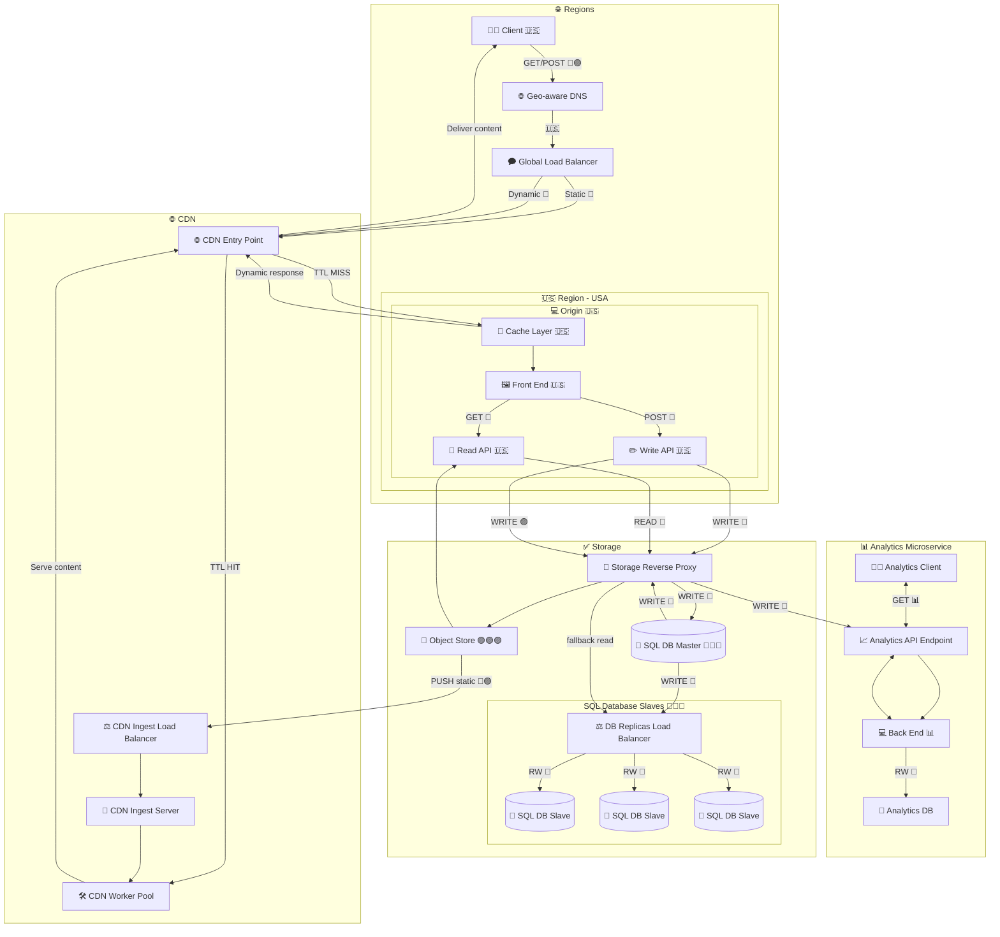

```mermaid
graph TD

  %% Subgraph: Regions
  subgraph regions [🌐 Regions]
    clientus[🧑‍💻 Client 🇺🇸]
    geodns[🌐 Geo-aware DNS]
    globallb[🗭 Global Load Balancer]

    subgraph us_region[🇺🇸 Region - USA]
      subgraph us_origin[💻 Origin 🇺🇸]
        us_cache[🧊 Cache Layer 🇺🇸]
        us_frontend[🖼️ Front End 🇺🇸]
        us_read_api[📖 Read API 🇺🇸]
        us_write_api[✏️ Write API 🇺🇸]
      end
    end
  end

  %% Subgraph: Analytics Microservice
  subgraph analyticsmicroservice[📊 Analytics Microservice]
    analyticsclient[🧑‍💻 Analytics Client]
    analyticsapiendpoint[📈 Analytics API Endpoint]
    analyticsapiserver[💻 Back End 📊]
    analyticsdb[📒 Analytics DB]
  end

  %% Subgraph: SQL + Object Storage
  subgraph sqldb[✅ Storage]
    storagereverseproxy[🔄 Storage Reverse Proxy]
    objectstore[🧺 Object Store 🟣🟣🟣]
    sqlmaster[(📒 SQL DB Master 📄📄📄)]
    subgraph sqlslaves[SQL Database Slaves 📄📄📄]
      dbloadbalancer[⚖️ DB Replicas Load Balancer]
      sqlslave1[(📒 SQL DB Slave)]
      sqlslave2[(📒 SQL DB Slave)]
      sqlslave3[(📒 SQL DB Slave)]
    end
  end

  %% Subgraph: CDN Layer
  subgraph cdn [🌐 CDN]
    cdnentrypoint[🌐 CDN Entry Point]
    cdnloadbalancer[⚖️ CDN Ingest Load Balancer]
    cdnserver[🔄 CDN Ingest Server]
    cdnworkerpool[🛠️ CDN Worker Pool]
  end

  %% ===========================
  %% ======= Traffic Flow =======
  %% ===========================

  %% Entry Path
  clientus -->|GET/POST 📄🟣| geodns
  geodns -->|🇺🇸| globallb

  %% Static content routes to CDN entry point
  globallb -->|Static 📄| cdnentrypoint

  %% Dynamic content or cache miss also goes to CDN entry point
  globallb -->|Dynamic 📄| cdnentrypoint

  %% CDN Entry Point logic
  cdnentrypoint -->|TTL HIT| cdnworkerpool
  cdnentrypoint -->|TTL MISS| us_cache

  %% Response Path (always flows back via CDN entry)
  cdnworkerpool -->|Serve content| cdnentrypoint
  us_cache -->|Dynamic response| cdnentrypoint
  cdnentrypoint -->|Deliver content| clientus

  %% CDN Ingest Path (Origin → CDN)
  objectstore -->|PUSH static 📄🟣| cdnloadbalancer
  cdnloadbalancer --> cdnserver
  cdnserver --> cdnworkerpool

  %% Origin App Logic
  us_cache --> us_frontend
  us_frontend -->|GET 📄| us_read_api
  us_frontend -->|POST 📄| us_write_api

  us_write_api -->|WRITE 📄| storagereverseproxy
  us_read_api -->|READ 📄| storagereverseproxy
  storagereverseproxy -->|WRITE 📄| sqlmaster
  us_write_api -->|WRITE 🟣| storagereverseproxy
  storagereverseproxy --> objectstore
  objectstore --> us_read_api

  %% DB Replication
  sqlmaster -->|WRITE 📄| dbloadbalancer
  dbloadbalancer -->|RW 📄| sqlslave1
  dbloadbalancer -->|RW 📄| sqlslave2
  dbloadbalancer -->|RW 📄| sqlslave3

  %% Analytics
  sqlmaster -->|WRITE 📄| storagereverseproxy
  storagereverseproxy -->|WRITE 📄| analyticsapiendpoint
  analyticsapiendpoint --> analyticsapiserver
  analyticsapiserver -->|RW 📄| analyticsdb
  analyticsclient <-->|GET 📊| analyticsapiendpoint
  analyticsapiendpoint <--> analyticsapiserver

  %% Storage Failover
  storagereverseproxy -->|fallback read| dbloadbalancer
```
