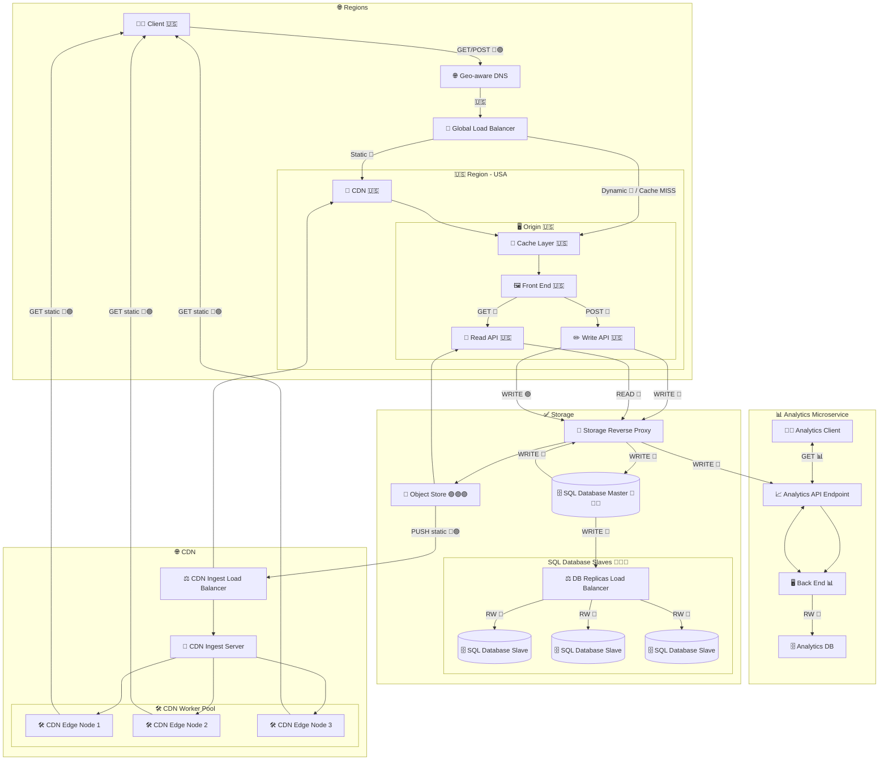

```mermaid
graph TD

    %% Subgraph: Regions
    subgraph regions [🌐 Regions]
        clientus[🧑‍💻 Client 🇺🇸]
        geodns[🌐 Geo-aware DNS]
        globallb[🧭 Global Load Balancer]

        subgraph regionus[🇺🇸 Region - USA]
            cdnus[🍱 CDN 🇺🇸]
            subgraph usorigin[🖥️ Origin 🇺🇸]
                uscache[🧊 Cache Layer 🇺🇸]
                usfrontend[🖼️ Front End 🇺🇸]
                usreadapi[📖 Read API 🇺🇸]
                uswriteapi[✏️ Write API 🇺🇸]
            end
        end
    end

    %% Subgraph: Analytics Microservice
    subgraph analyticsmicroservice[📊 Analytics Microservice]
        analyticsclient[🧑‍💻 Analytics Client]
        analyticsapiendpoint[📈 Analytics API Endpoint]
        analyticsapiserver[🖥️ Back End 📊]
        analyticsdb[🗄️ Analytics DB]
    end

    %% Subgraph: SQL + Object Storage
    subgraph sqldb[✅ Storage]
        storagereverseproxy[🔄 Storage Reverse Proxy]
        objectstore[🧺 Object Store 🟣🟣🟣]
        sqlmaster[(🗄️ SQL Database Master 📄📄📄)]
        subgraph sqlslaves[SQL Database Slaves 📄📄📄]
            dbloadbalancer[⚖️ DB Replicas Load Balancer]
            sqlslave1[(🗄️ SQL Database Slave)]
            sqlslave2[(🗄️ SQL Database Slave)]
            sqlslave3[(🗄️ SQL Database Slave)]
        end
    end

    %% Subgraph: CDN Layer
    subgraph cdn [🌐 CDN]
        cdnloadbalancer[⚖️ CDN Ingest Load Balancer]
        cdnserver[🔄 CDN Ingest Server]
        subgraph cdnworkerpool[🛠️ CDN Worker Pool]
            cdnworker1[🛠️ CDN Edge Node 1]
            cdnworker2[🛠️ CDN Edge Node 2]
            cdnworker3[🛠️ CDN Edge Node 3]
        end
    end

    %% ============================
    %% ======= Traffic Flow =======
    %% ============================

    %% Client to DNS to Load Balancer
    clientus -->|GET/POST 📄🟣| geodns
    geodns -->|🇺🇸| globallb

    %% Static: Global Load Balancer to CDN
    globallb -->|Static 📄| cdnus

    %% Dynamic & Fallback: Global Load Balancer to Origin
    globallb -->|Dynamic 📄 / Cache MISS| uscache

    %% CDN Routing (optional replication)
    cdnloadbalancer --> cdnus

    %% CDN Ingest (Object Store to Edge)
    objectstore -->|PUSH static 📄🟣| cdnloadbalancer
    cdnloadbalancer --> cdnserver
    cdnserver --> cdnworker1
    cdnserver --> cdnworker2
    cdnserver --> cdnworker3

    %% CDN edge nodes serve static content
    cdnworker1 -->|GET static 📄🟣| clientus
    cdnworker2 -->|GET static 📄🟣| clientus
    cdnworker3 -->|GET static 📄🟣| clientus

    %% CDN to Origin via Cache
    cdnus --> uscache
    uscache --> usfrontend
    usfrontend -->|GET 📄| usreadapi
    usfrontend -->|POST 📄| uswriteapi

    %% API to Storage
    uswriteapi -->|WRITE 📄| storagereverseproxy
    usreadapi -->|READ 📄| storagereverseproxy
    storagereverseproxy -->|WRITE 📄| sqlmaster
    uswriteapi -->|WRITE 🟣| storagereverseproxy
    storagereverseproxy --> objectstore
    objectstore --> usreadapi

    %% SQL Replication
    sqlmaster -->|WRITE 📄| dbloadbalancer
    dbloadbalancer -->|RW 📄| sqlslave1
    dbloadbalancer -->|RW 📄| sqlslave2
    dbloadbalancer -->|RW 📄| sqlslave3

    %% Analytics pipeline
    sqlmaster -->|WRITE 📄| storagereverseproxy
    storagereverseproxy -->|WRITE 📄| analyticsapiendpoint
    analyticsapiendpoint --> analyticsapiserver
    analyticsapiserver -->|RW 📄| analyticsdb
    analyticsclient <-->|GET 📊| analyticsapiendpoint
    analyticsapiendpoint <--> analyticsapiserver
```

