```mermaid
graph TD
  %% Clients and Entry
  subgraph globalinfra [🌐 Global Infra]
    C1[🧑‍💻 Customers]
    DNS[🌐 GeoDNS]
    LB[⚖️ Global LB]
  end

  %% Application Stack
  subgraph ledgerstack [🏦 Ledger Stack]
    WAF[🛡️ WAF]
    AUTH[🔐 Auth]
    GATEWAY[🔀 Gateway]
    TXN[🔄 Transactions]
    CONSISTENCY[⚖️ Consistency]
    WRITE[📒 DB Write]
    AUDIT[📝 Audit]
    STREAM[📡 Events]
  end

  %% Storage
  subgraph storage [🗄️ Storage]
    MASTER[(📒 Master DB)]
    REPLICAS[(📒📒 Replicas)]
    DBLB[⚖️ DB LB]
  end

  %% Monitoring
  subgraph observability [📈 Observability]
    LOG[📜 Logs]
    DASH[📊 Dashboard]
  end

  %% Flow
  C1 --> DNS --> LB --> WAF --> AUTH --> GATEWAY --> TXN --> CONSISTENCY --> WRITE
  WRITE --> MASTER -->|Replicates| REPLICAS
  DBLB --> REPLICAS
  WRITE --> AUDIT --> STREAM
  WRITE --> LOG
  TXN --> LOG
  LOG --> DASH

```

```mermaid
graph TD
	%% Subgraph: Global Nodes
	subgraph global [🌐 Global Infrastructure]
        subgraph clients[🧑‍💻 Customers 🇺🇸 🇪🇺 🇮🇱 🇯🇵]
            us_customer[🧑‍💻 Customer 🇺🇸]
            eu_customer[🧑‍💻 Customer 🇪🇺]
            il_customer[🧑‍💻 Customer 🇮🇱]
            jp_customer[🧑‍💻 Customer 🇯🇵]
        end
        geodns[🌐 Geo-aware DNS]
        globallb[⚖️ Global Load Balancer]
	end

    %% Regional Application Stack
    subgraph regions[Regions - USA, EU, etc]
        subgraph transaction_ledger[📒 Bank Transaction Ledger 🇺🇸 🇪🇺 🇮🇱 🇯🇵]
            waf[🛡️ WAF / Rate Limiter]
            authservice[🔐 Auth Service]
            ledger_gateway[🔀 Ledger Gateway]
            transaction_service[🔄 Transaction Service]
            consistency_manager[⚖️ Consistency Manager]
            audit_logger[📝 Audit Logger]
            db_write[📒 Ledger DB Write Service]
            event_stream[📡 Event Streaming Platform]
        end
    end

    %% Storage Layer
	subgraph storage[✅ Data Storage]
		ledger_db_master[(📒 Ledger DB Master - ACID)]
        ledger_db_replicas[(📒📒📒 Ledger DB Replicas)]
		db_load_balancer[⚖️ Replica Load Balancer]
	end

	%% Monitoring
	subgraph observability[🧭 Observability]
        logcollector[📜 Log Collector]
        monitoring_dashboard[📊 Monitoring Dashboard]
	end

	%% Traffic Flow
	clients -->|Ledger Write 🧾| geodns
	geodns --> globallb
    globallb -->|Route Request| waf

    waf --> authservice
    authservice --> ledger_gateway

    ledger_gateway --> transaction_service
    transaction_service --> consistency_manager
    consistency_manager --> db_write
    db_write --> ledger_db_master
    ledger_db_master -->|Replication 🔁| ledger_db_replicas
    db_load_balancer --> ledger_db_replicas

    db_write --> audit_logger
    audit_logger --> event_stream

	%% Logging and Monitoring
	db_write --> logcollector
	transaction_service --> logcollector
	logcollector --> monitoring_dashboard

```

## Detailed Explanation of the Design and Decisions

 1. **Global Infrastructure:**
 - Ensures user transactions are routed to the nearest region, reducing latency and improving fault isolation.

 2. **Application Stack:**
 - WAF/Rate Limiter secures the perimeter.
 - Auth Service ensures only authorized users and systems can write to the ledger.
 - Ledger Gateway routes incoming requests to services responsible for transaction processing.
 - Transaction Service handles transaction initiation, validation, and sequencing.
 - Consistency Manager enforces ordering, locking, and isolation.
 - Audit Logger captures all events to an immutable stream for later inspection or rollback.

 3. **Storage Layer:**
 - ACID-compliant master database ensures strict transaction integrity.
 - Replicas and load balancing improve read scalability and fault tolerance.

 4. **Monitoring and Observability:**
 - Logs, audit trails, and metrics provide full operational and forensic visibility.

## Questions and Answers

### 1. How would you architect a highly available, consistent ledger?

- Use an ACID-compliant SQL database as the primary store (e.g., PostgreSQL or CockroachDB).
- Place the write service behind load balancers with quorum/consensus strategies.
- Add multi-region replication with conflict resolution and failover policies.
- Immutable audit logging through append-only streams (e.g., Kafka, Apache Pulsar).

### 2. Explain your approach to maintaining ACID compliance and transaction integrity.

- Each transaction is wrapped in a DB transaction block to ensure **atomicity** and **consistency**.
- Isolation is enforced via row-level locks or snapshot isolation.
- Only committed transactions are replicated.
- Auditing ensures **durability** with traceable logs.

### 3. Discuss how you would manage concurrency, latency, and data replication.

- Use row-level locking and serialized transactions to avoid race conditions.
- For latency, use write-ahead logs, in-memory queues, and asynchronous replication.
- Replicate data to read-only replicas using streaming replication.
- Use consensus algorithms (e.g., Raft) in distributed DBs to avoid split-brain scenarios.
