```mermaid
graph TD
  %% Global Entry
  subgraph infra [🌐 Infra]
    USER[🧑‍💻 Users] --> DNS[🌐 DNS] --> LB[⚖️ Load Balancer]
  end

  %% Core Transaction Flow
  subgraph tx [💳 Transactions]
    LB --> WAF[🛡️ WAF] --> AUTH[🔐 Auth] --> GATEWAY[💲 Gateway]
    GATEWAY --> FRAUD[⚠️ Fraud Check] --> DECIDE[🧠 Decision]
    DECIDE --> WRITE[📒 Write DB]
  end

  %% Storage
  subgraph db [🗄️ DB]
    WRITE --> MASTER[(📒 Master)]
    MASTER --> REPLICA[(📒📒 Replica)]
  end

  %% ML + Analytics
  subgraph ai [📊 Analytics + ML]
    DECIDE --> API[📑 API]
    API --> BACKEND[💻]
    BACKEND --> DATA[🗄️ Data]

    WRITE --> INGEST[📥 Ingest] --> TRAIN[🔄 Train] --> SERVE[🚀 Serve]
    SERVE --> FRAUD
  end

  %% Monitoring
  subgraph obs [📈 Monitoring]
    LOG[📜 Logs] --> MON[📊 Dashboard]
    FRAUD --> LOG
    GATEWAY --> LOG
  end
```

---

## Detailed Explanation of the Design and Decisions

 1. Global Infrastructure:
 - Geo-aware DNS and a global load balancer ensure low latency and high availability, routing requests efficiently based on customer location.

 2. Regional Application Stack:
 - WAF/Rate Limiter protects against malicious traffic and DDOS attacks.
 - Authentication & Authorization service validates customers and secures transaction processing.
 - Transaction Gateway acts as the central point for receiving transactions, ensuring a streamlined flow.
 - Real-time Fraud Detection analyzes transactions immediately using rules-based and ML-driven models for instant decisions.
 - Fraud Decision Engine evaluates and flags potentially fraudulent transactions based on analysis.
 - Transaction Ledger securely records approved transactions for traceability and compliance.
 - Event Streaming Platform facilitates real-time communication between components, ensuring rapid response and continuous data flow.

 3. Fraud Analytics Microservice:
 - Analytics Dashboard provides insights and reporting to identify fraud patterns and system effectiveness.
 - Analytics API and Backend handle complex analytical queries and interactions with historical fraud data.
 - Historical Fraud Data storage supports detailed analysis, enabling comprehensive fraud evaluation.
 - ML Pipeline incorporates continuous data ingestion, model training, serving, and scheduled retraining to adapt to evolving fraud tactics.

 4. Storage Layer:
 - Transaction DB Master and replicas ensure data durability, high availability, and scalability.
 - Load balancer manages read-heavy traffic effectively across replicas.

 5. Monitoring and Observability:
 - Log Collector and Monitoring Dashboard provide critical visibility into system health and operations, facilitating rapid detection and remediation of issues.

 This design emphasizes scalability, real-time processing, continuous improvement through ML, and robust security practices to effectively manage and mitigate fraud risks in global transaction processing.

## Questions and Answers

### 1. How would you detect fraudulent transactions in real-time?

Real-time fraud detection in this design is managed by the **Real-time Fraud Detection** module and **Fraud Decision Engine**. The transaction data flows directly from the transaction gateway into the real-time fraud detection module, which quickly evaluates each transaction based on predefined rules and models. Transactions flagged as suspicious are sent to the Fraud Decision Engine for deeper analysis, which decides whether transactions are fraudulent by incorporating real-time ML model scores and heuristics.

### 2. What algorithms or machine learning techniques would you consider?

The fraud detection system leverages an ML pipeline that continuously improves fraud detection models. Algorithms and techniques considered include:

* **Supervised Learning**:

  * Logistic Regression for interpretability.
  * Decision Trees and Random Forests for robust, nonlinear relationships.
  * Gradient Boosted Trees (e.g., XGBoost, LightGBM) for high accuracy.
* **Anomaly Detection**:

  * Isolation Forests to detect abnormal transactions.
  * Autoencoders for recognizing unusual transaction patterns.
* **Real-time Stream Processing**:

  * Kafka Streams or Apache Flink to process transactions instantly.
* **Continuous Model Retraining**:

  * Scheduled batch jobs for periodic retraining using fresh data.

### 3. How would you handle scalability and latency?

Scalability and latency management are achieved through several strategic decisions:

* **Geo-aware DNS and Global Load Balancer**:

  * Efficiently routes user requests to the nearest data centers to minimize latency and ensure fast transaction processing.
* **Event Streaming Platform (Kafka)**:

  * Enables horizontal scalability and real-time data streaming to reduce latency.
* **Distributed Database and Replication**:

  * Ensures high availability, fault tolerance, and quick data retrieval through replicated database clusters.
* **Load Balancing**:

  * Balances read operations across replicas, managing high query loads efficiently.
* **ML Pipeline and Model Serving**:

  * Real-time model serving ensures low-latency predictions for incoming transactions, supported by scalable infrastructure.

These combined measures ensure the system maintains high throughput and minimal latency, critical for responsive and reliable fraud detection.
