```mermaid
graph TD
  %% Infra
  subgraph infra [🌐 Infra]
    USER[🧑‍💻 Customers] --> DNS[🌐 DNS] --> LB[⚖️ Load Balancer]
  end

  %% Banking Stack
  subgraph banking [🏦 Banking System]
    LB --> WAF[🛡️ WAF] --> AUTH[🔐 Auth]
    AUTH --> GATEWAY[🏦 Gateway]
    GATEWAY --> TXN[🔄 Transactions]
    TXN --> WRITE[📒 Ledger]
    WRITE --> MASTER[(📒 DB Master)] --> REPLICA[(📒📒 Replicas)]
  end

  %% Observability
  subgraph obs [📈 Monitoring]
    TXN --> LOG[📜 Logs] --> DASH[📊 Dashboard]
    AUTH --> LOG
  end
```

```mermaid
graph TD
	%% Subgraph: Global Nodes
	subgraph global [🌐 Global Infrastructure]
        subgraph clients[🧑‍💻 Customers 🇺🇸 🇪🇺 🇮🇱 🇯🇵]
            us_customer[🧑‍💻 Customer 🇺🇸]
            eu_customer[🧑‍💻 Customer 🇪🇺]
            il_customer[🧑‍💻 Customer 🇮🇱]
            jp_customer[🧑‍💻 Customer 🇯🇵]
        end
        geodns[🌐 Geo-aware DNS]
        globallb[⚖️ Global Load Balancer]
	end

    %% Regional Application Stack
    subgraph regions[Regions - USA, EU, etc]
        subgraph online_banking[🏦 Online Banking 🇺🇸 🇪🇺 🇮🇱 🇯🇵]
            waf[🛡️ WAF / Rate Limiter]
            authservice[🔐 Auth Service (OAuth2, MFA)]
            banking_gateway[🏦 Banking Gateway]
            account_service[💼 Account Service]
            transaction_service[🔄 Transaction Service]
            balance_service[📊 Balance Service]
            db_write[📒 Transaction Ledger]
            event_stream[📡 Event Streaming Platform]
        end
    end

	%% Storage Layer
	subgraph storage[✅ Data Storage]
		banking_db_master[(📒 Core Banking DB Master)]
        banking_db_replicas[(📒📒📒 DB Replicas)]
		db_load_balancer[⚖️ Replica Load Balancer]
	end

	%% Monitoring
	subgraph observability[🧭 Observability]
        logcollector[📜 Log Collector]
        monitoring_dashboard[📊 Monitoring Dashboard]
	end

	%% Traffic Flow
	clients -->|Online Banking Request 💼| geodns
	geodns --> globallb
    globallb -->|Route Request| waf

    waf --> authservice
    authservice --> banking_gateway

    banking_gateway --> account_service
    banking_gateway --> transaction_service
    banking_gateway --> balance_service

    transaction_service --> db_write
    db_write --> banking_db_master
    banking_db_master -->|Replication 🔁| banking_db_replicas
    db_load_balancer --> banking_db_replicas

    db_write --> event_stream

	%% Logging and Monitoring
	transaction_service --> logcollector
	authservice --> logcollector
	logcollector --> monitoring_dashboard
```

<div style="page-break-after: always;"></div>

## Detailed Explanation of the Design and Decisions

 1. **Global Infrastructure:**
 - Geo-aware DNS and a global load balancer direct users to the nearest available region, improving performance and reducing latency.

 2. **Regional Application Stack:**
 - WAF protects from threats and enforces rate limiting to mitigate abuse.
 - Auth Service provides secure login via OAuth2, multi-factor authentication (MFA), and role-based access control.
 - The Banking Gateway routes requests securely to dedicated microservices.
 - Account, Transaction, and Balance Services are isolated for maintainability and scalability.
 - Transaction Ledger is the source of truth for financial operations and supports atomic operations.
 - Event Stream allows asynchronous processing, decouples components, and supports audit logging.

 3. **Storage Layer:**
 - The core banking database supports strong consistency for financial operations.
 - Master-replica setup allows for high availability and scalability, with a load balancer handling read traffic.

 4. **Monitoring and Observability:**
 - Logging and metrics are aggregated to ensure security incidents, failures, and performance issues are detected and resolved quickly.

<div style="page-break-after: always;"></div>

## Questions and Answers

### 1. How would you ensure secure authentication and authorization?

- Use OAuth2 with short-lived access tokens and refresh tokens.
- Implement Multi-Factor Authentication (MFA) for sensitive actions.
- Enforce RBAC (Role-Based Access Control) and device fingerprinting.
- Ensure all communication is encrypted via TLS, and tokens are scoped and validated strictly.

### 2. Describe how you would handle data consistency, especially with concurrent transactions.

- Use ACID-compliant relational databases for transactional data.
- Wrap financial operations in database transactions with row-level locking to prevent race conditions.
- Use optimistic locking or versioning when concurrent access patterns are expected.
- Design idempotent APIs to avoid double processing.

### 3. How would you handle scalability, fault tolerance, and disaster recovery?

- Use stateless services behind load balancers to horizontally scale.
- Deploy in multiple availability zones and regions.
- Employ database replication and periodic backups.
- Use event streaming for asynchronous retries and eventual consistency where perfect consistency isn't required.
- Regularly test failover procedures and backup restoration.
