```mermaid
graph TD

  %% Infra
  subgraph infra [🌐 Infra]
    USER[🧑‍💻 Customers] --> DNS[🌐 DNS] --> LB[⚖️ Load Balancer]
  end

  %% Core Payments
  subgraph payment [💳 Payments]
    LB --> WAF[🛡️ WAF] --> AUTH[🔐 Auth] --> GATEWAY[💲 Gateway]
    GATEWAY --> PROCESSOR[🔄 Processor] --> SETTLE[🏦 Settlement] --> LEDGER[📒 Ledger]
  end

  %% Storage
  subgraph db [🗄️ Storage]
    LEDGER --> MASTER[(📒 Master DB)] --> REPLICA[(📒📒 Replicas)]
  end

  %% Compliance
  subgraph compliance [📋 Compliance]
    LEDGER --> API[📑 API] --> BACKEND[💻 Backend] --> DATA[🗄️ DB]
  end

  %% Monitoring
  subgraph monitor [📈 Monitoring]
    PROCESSOR --> LOG[📜 Logs] --> DASH[📊 Dashboard]
    GATEWAY --> LOG
  end
```

```mermaid
graph TD
	%% Subgraph: Global Nodes
	subgraph global [🌐 Global Infrastructure]
        subgraph clients[🧑‍💻 Customers 🇺🇸 🇪🇺 🇮🇱 🇯🇵]
            us_customer[🧑‍💻 Customer 🇺🇸]
            eu_customer[🧑‍💻 Customer 🇪🇺]
            il_customer[🧑‍💻 Customer 🇮🇱]
            jp_customer[🧑‍💻 Customer 🇯🇵]
        end
        geodns[🌐 Geo-aware DNS]
        globallb[⚖️ Global Load Balancer]
	end

    %% Regional Application Stack
    subgraph regions[Regions - USA, EU, etc]
        subgraph payment_processing[💳 Payment Processing 🇺🇸 🇪🇺 🇮🇱 🇯🇵]
            waf[🛡️ WAF / Rate Limiter]
            authservice[🔐 Authentication & Authorization]
            payment_gateway[💲 Payment Gateway]
            payment_processor[🔄 Payment Processor]
            settlement_engine[🏦 Settlement Engine]
            db_write[📒 Transaction Ledger]
            event_stream[📡 Event Streaming Platform]
        end
    end

	%% Compliance Microservice
	subgraph compliance[📋 Compliance and Regulatory]
		compliance_dashboard[📈 Compliance Dashboard]
		compliance_api[📑 Compliance API]
		compliance_backend[💻 Compliance Backend]
		compliance_db[🗄️ Compliance Data]
	end

    %% Storage Layer
	subgraph storage[✅ Data Storage]
		transaction_db_master[(📒 Transaction DB Master)]
        transaction_db_replicas[(📒📒📒 DB Replicas)]
		db_load_balancer[⚖️ Replica Load Balancer]
	end

	%% Monitoring
	subgraph observability[🧭 Observability]
        logcollector[📜 Log Collector]
        monitoring_dashboard[📊 Monitoring Dashboard]
	end

	%% Traffic Flow
	clients -->|Payment Request 💳| geodns
	geodns --> globallb
    globallb -->|Route Request| waf

    waf --> authservice
    authservice --> payment_gateway

    payment_gateway --> payment_processor
    payment_processor --> settlement_engine

    settlement_engine --> db_write
    db_write --> transaction_db_master
    transaction_db_master -->|Replication 🔁| transaction_db_replicas
    db_load_balancer --> transaction_db_replicas

    db_write --> event_stream
    event_stream --> compliance_api

    %% Compliance Flow
    compliance_api --> compliance_backend
    compliance_backend --> compliance_db
    compliance_dashboard --> compliance_api

	%% Logging and Monitoring
	payment_processor --> logcollector
	payment_gateway --> logcollector
	logcollector --> monitoring_dashboard
```

## Detailed Explanation of the Design and Decisions

 1. **Secure Payment Architecture:**
 - Geo-aware DNS and global load balancer ensure secure, low-latency request routing.
 - WAF/Rate Limiter protects against unauthorized access and attacks.
 - Authentication & Authorization validates transactions and ensures secure identity verification.
 - Payment Gateway securely handles transaction initiation and routing to processors.
 - Payment Processor interfaces with banks and card networks securely to authorize transactions.
 - Settlement Engine securely manages financial settlements with banking institutions.

 2. **High Availability and Reliability:**
 - Global infrastructure and replicated data storage ensure system availability.
 - Event streaming enables real-time transaction processing and resilience through distributed architecture.
 - Transaction ledger databases are replicated for high availability and disaster recovery.
 - Load balancing evenly distributes traffic and avoids bottlenecks.

 3. **Compliance and Regulatory Standards:**
 - Compliance Microservice ensures adherence to regulatory standards, data protection laws, and transaction auditing requirements.
 - Compliance Dashboard offers real-time visibility into compliance metrics and potential issues.
 - Comprehensive logging and monitoring ensure compliance reporting and proactive issue detection.

 This architecture emphasizes secure transaction handling, reliability through distributed systems and replication, and comprehensive compliance mechanisms to effectively meet regulatory standards.

## Questions and Answers

### 1. How would you design the architecture to securely process payments?

The architecture incorporates secure routing through geo-aware DNS, strict authentication and authorization, and robust security measures at the gateway and processing levels. Each component, from the WAF to the payment processor, ensures secure transaction handling and sensitive data protection.

### 2. How do you ensure high availability and reliability?

High availability and reliability are achieved through globally distributed infrastructure, data replication across multiple database replicas, event-driven architectures to handle load efficiently, and load balancing mechanisms to distribute traffic optimally.

### 3. Discuss handling compliance and regulatory standards.

The compliance microservice centrally manages regulatory adherence, supported by comprehensive logging, monitoring, and real-time dashboards that provide transparency and proactive issue management to ensure consistent compliance with evolving regulations.
