# Pastebin Architecture Diagram

## Initial Diagram and Adding Storage

### ✅ Initial Setup

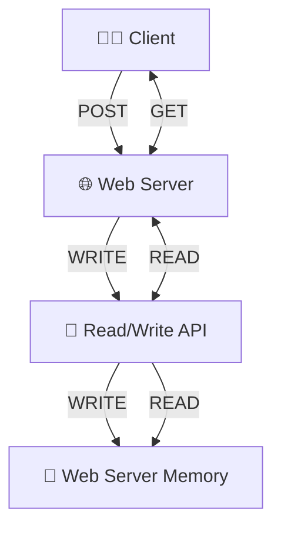

## Persisting Data

  

    
### ❌ Using Redis Cache

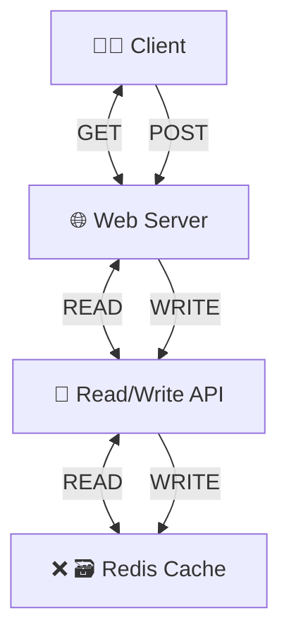
  

  

    
### ❌ Use Local Storage

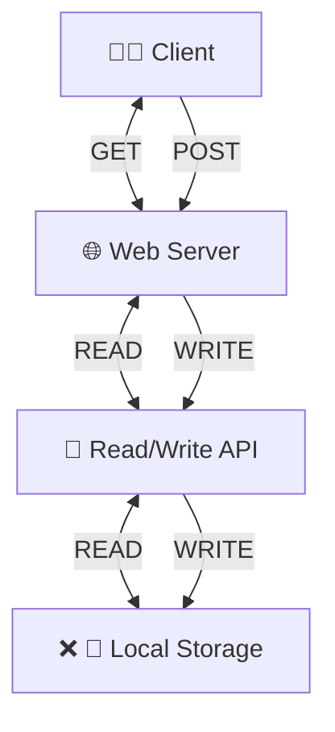
  

### ✅ Add SQL database

#### Single SQL Database

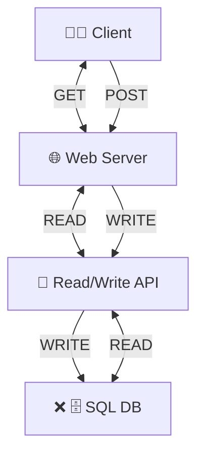

#### Relational Database Management System (RDBMS)

##### Master-Master Replication

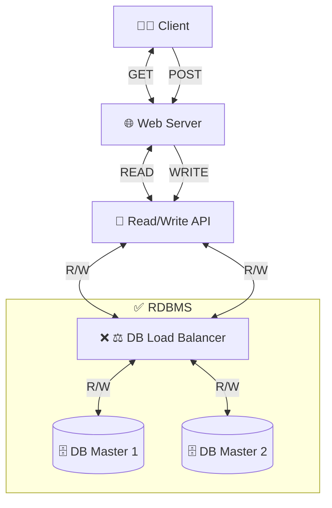

##### Master-Slave Replication

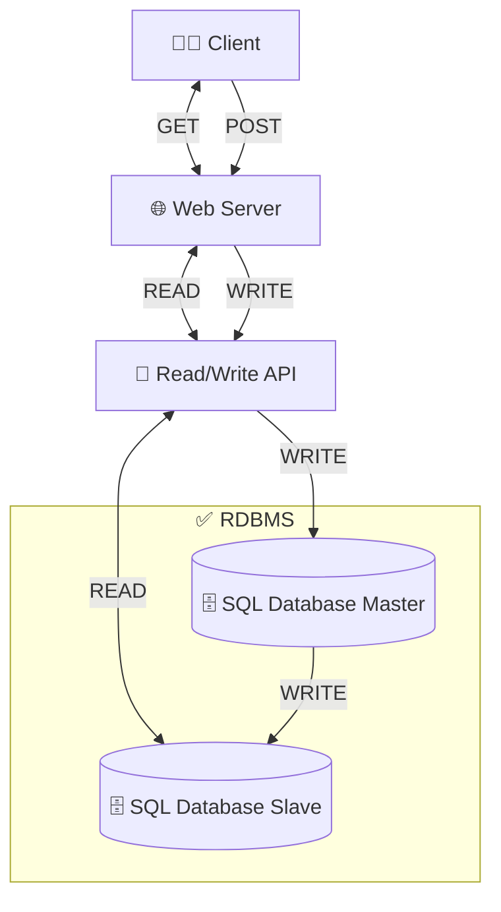

## Improve Write Request Performance

### ❌ Add more web servers

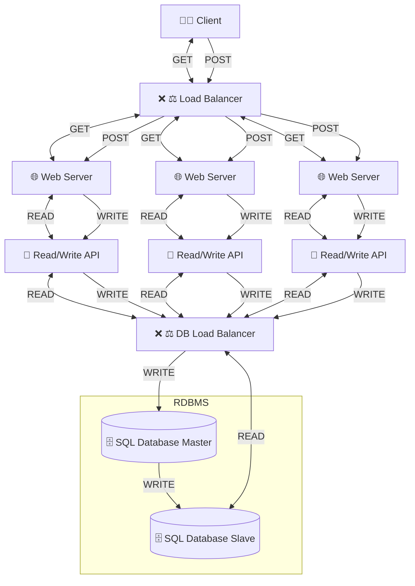

### ❌ Add client-side caching

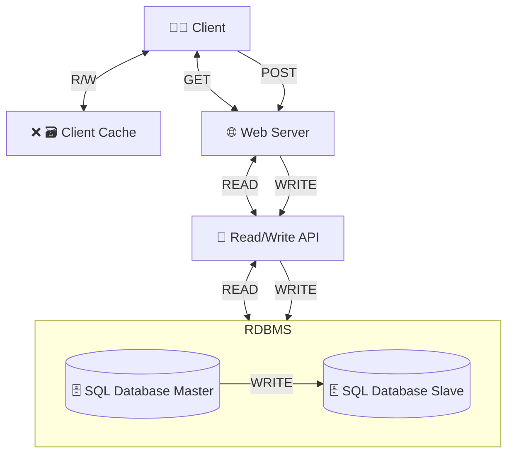

### ✅ Add Read API and Write API

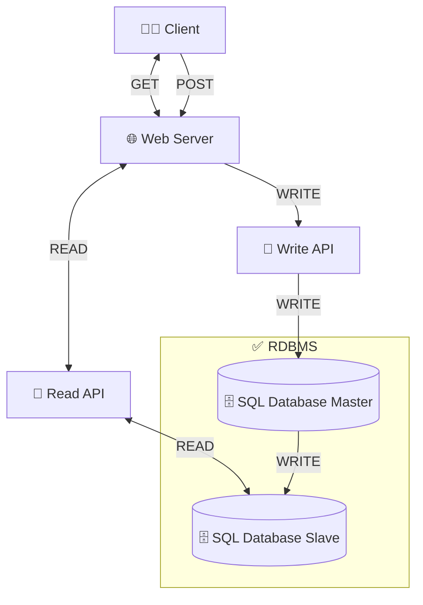

## Improve Read Request Performance

### ❌ Add SQL Master for Read API

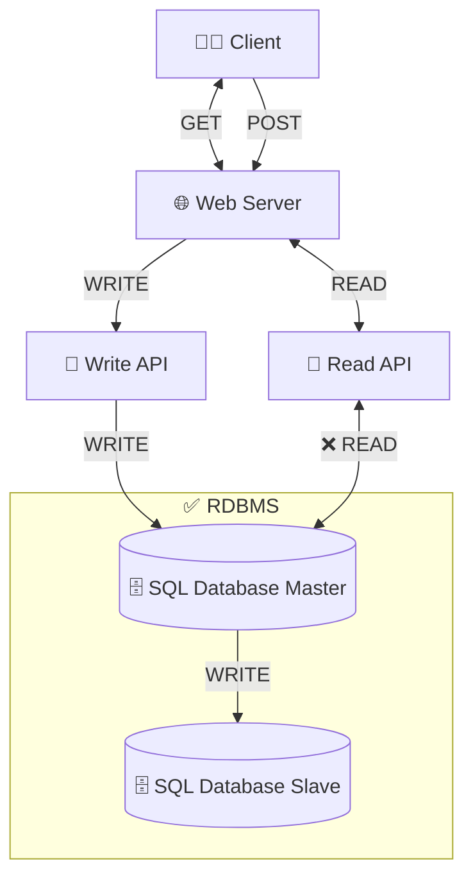

### ❌ Use file system for Read API

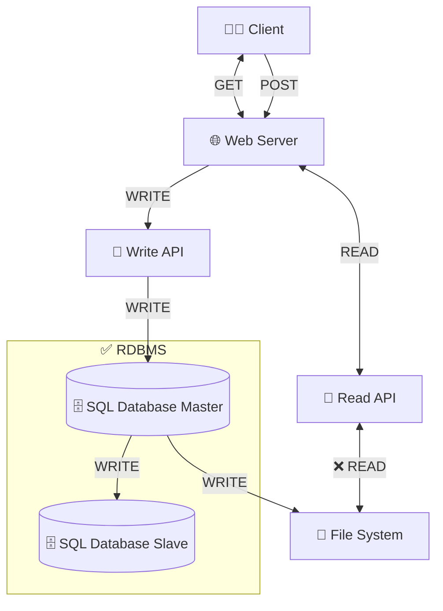

### ✅ Add SQL Replicas for Read API

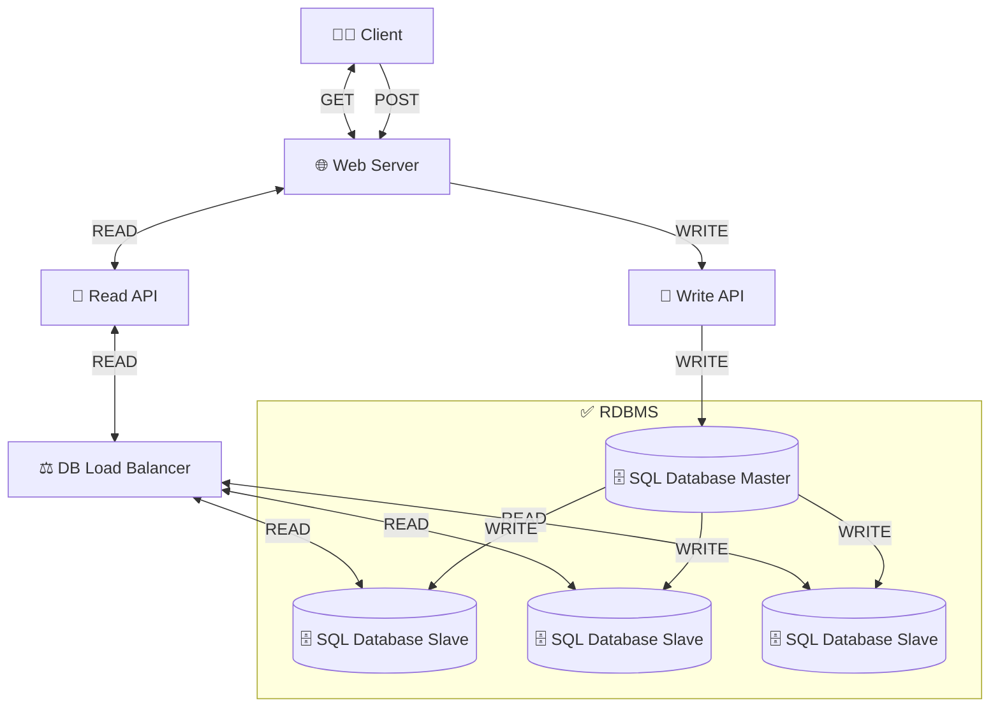

## Handle large files and blobs

### ❌ Encode large files as Base64 and store in SQL DB

### ❌ Compress large files with GZip and store in SQL DB

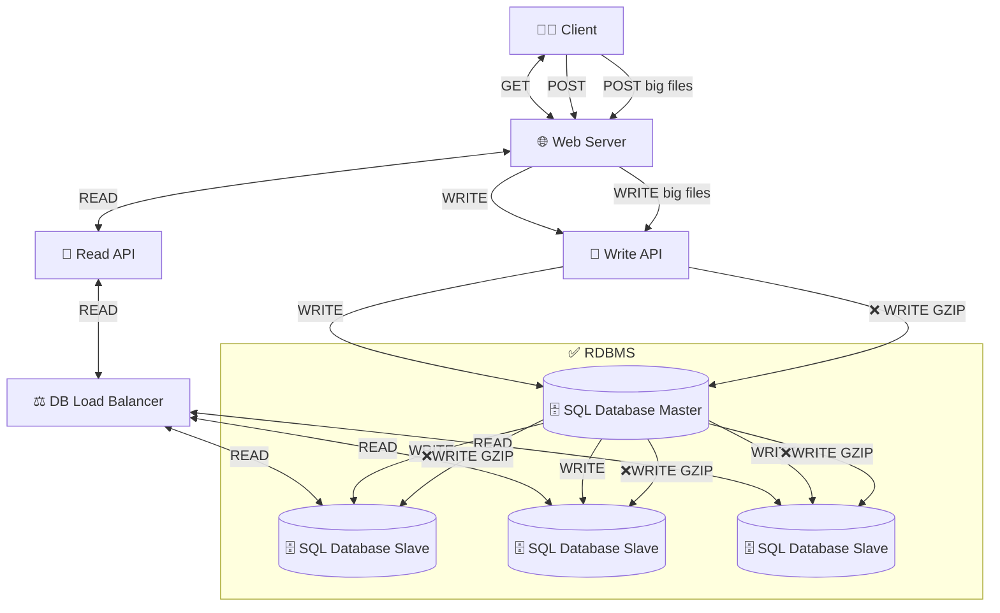

### ✅ Use Object Store for large files and blobs

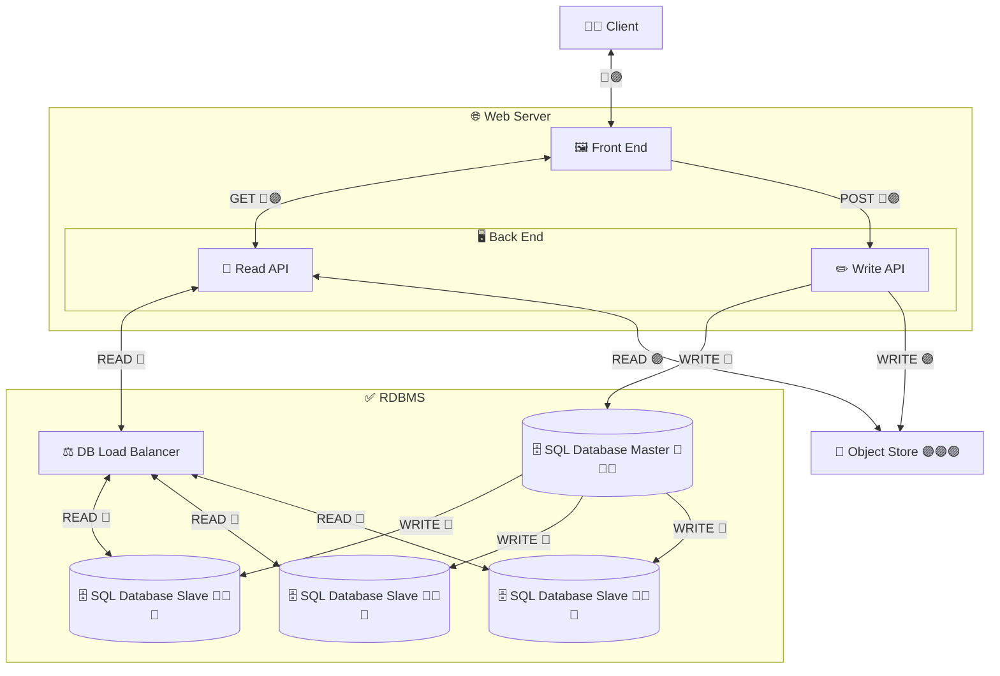

## Improve Static Content Delivery

### ❌ Add more web servers

### ❌ Cache static files in client browser

### ✅ Use CDN for static files

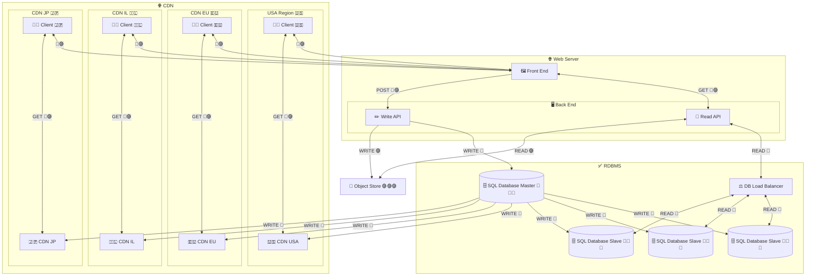

## Usage Stats and Analytics

### ✅ Add Analytics DB

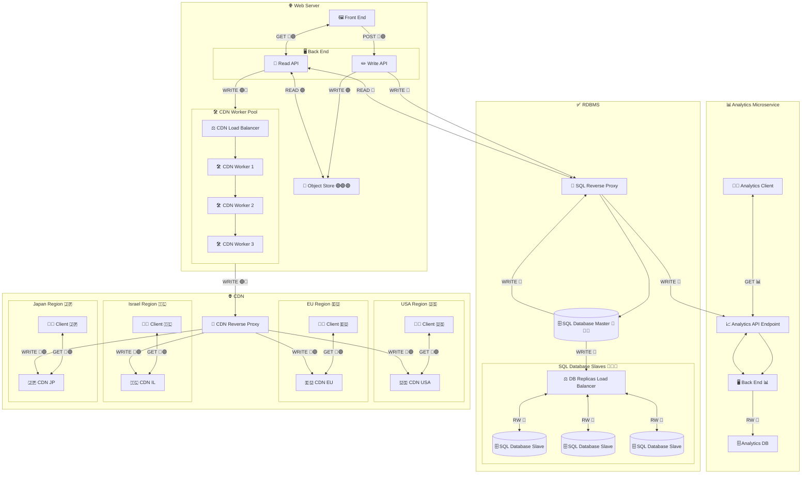

## Delays in DNS Resolution

### ✅ Add Geo-aware DNS Provider
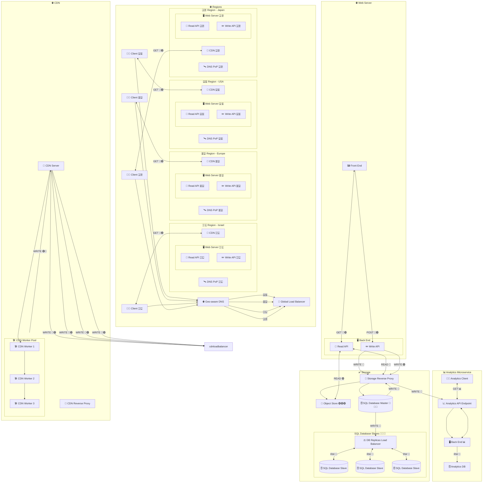
