# Pastebin Architecture Diagram

## Stage 0: Initial Diagram and Adding Storage

### ✅ Initial Setup

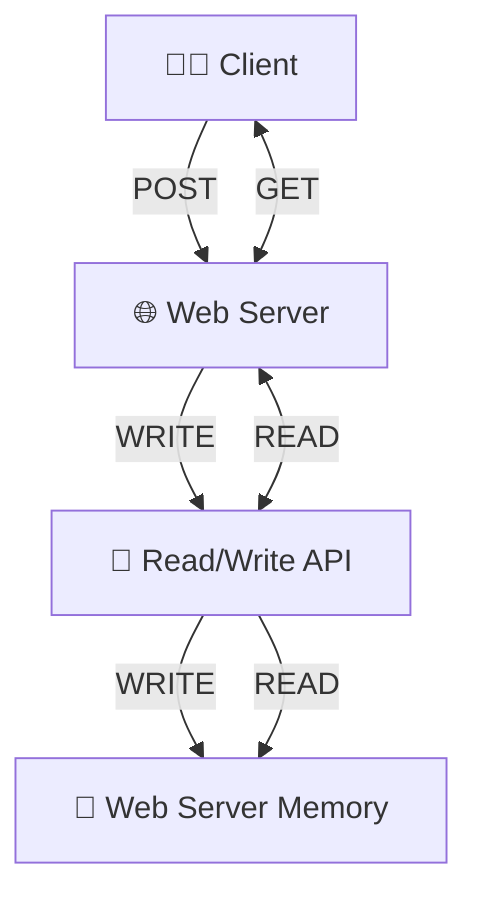

## Stage 1: Persisting Data

  

    
### ❌ Using Redis Cache

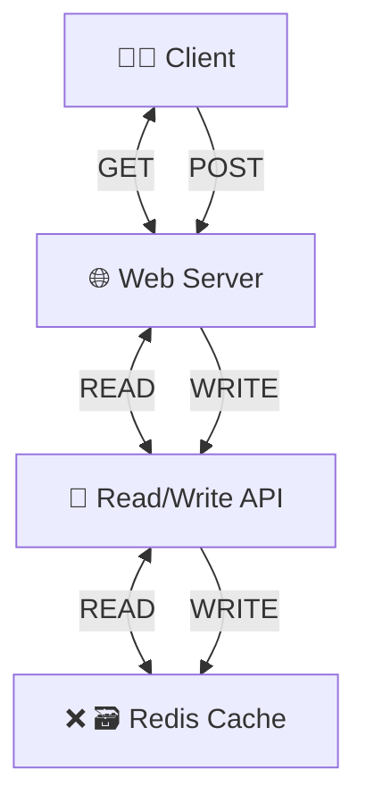
  

  

    
### ❌ Use Local Storage

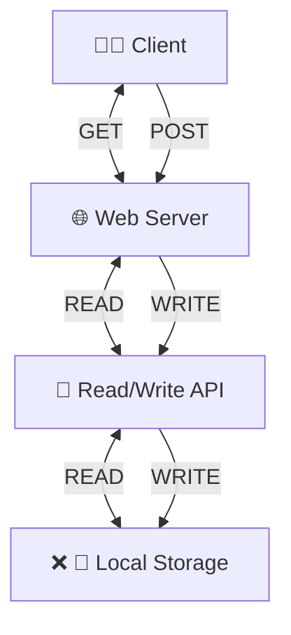
  

### ✅ Add SQL database

#### Single SQL Database

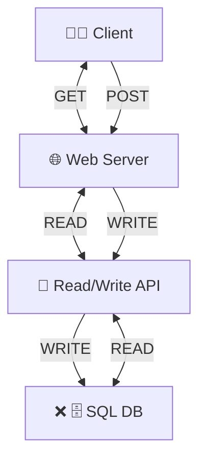

#### Relational Database Management System (RDBMS)

##### Master-Master Replication

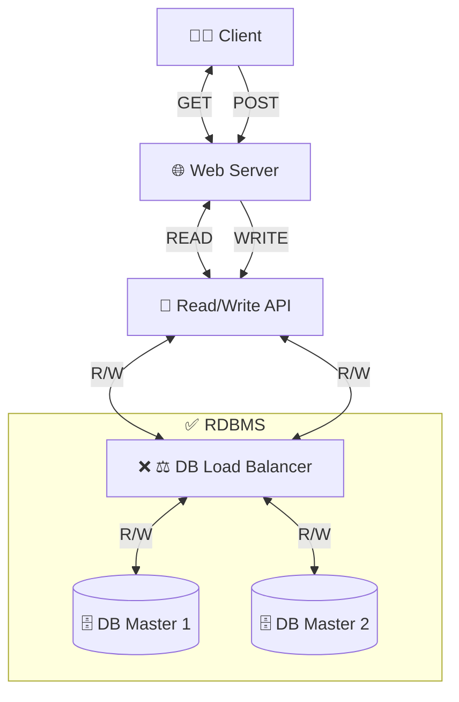

##### Master-Slave Replication

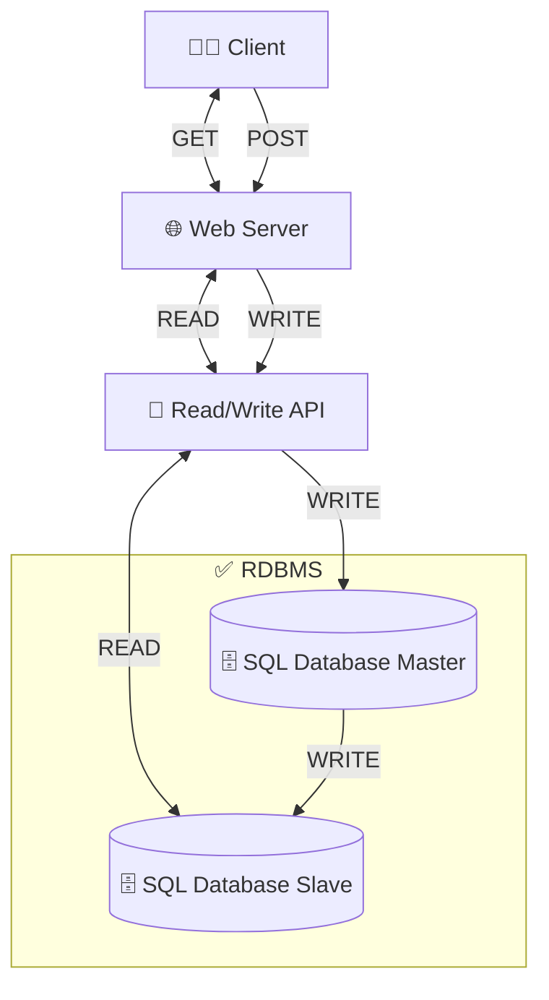

## Stage 2: Improve Write Request Performance

### ❌ Add more web servers

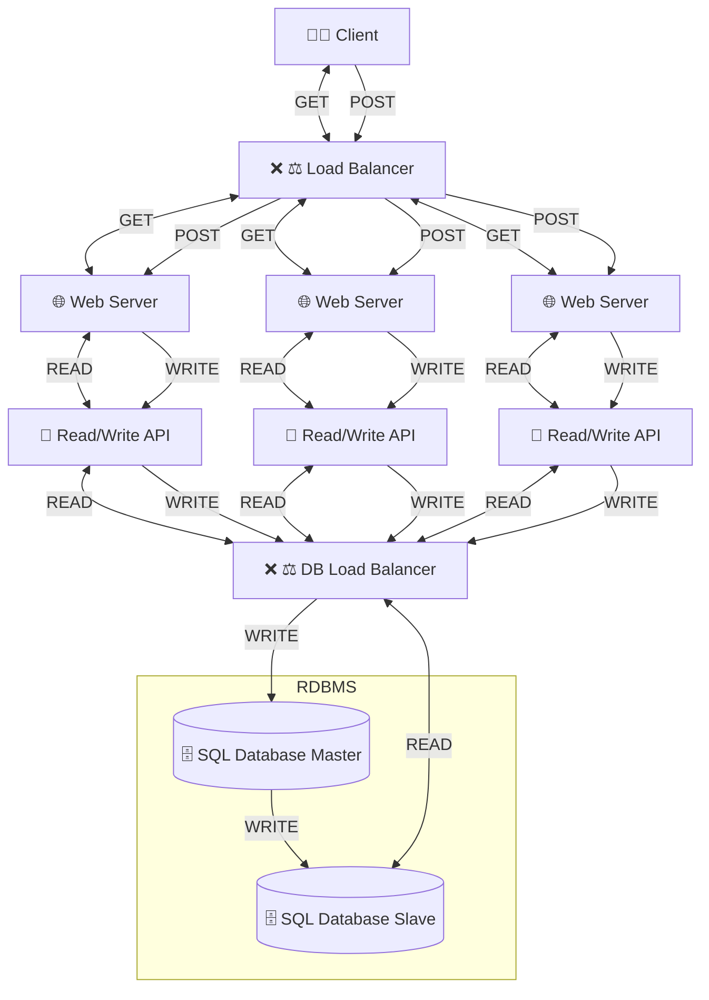

### ❌ Add client-side caching

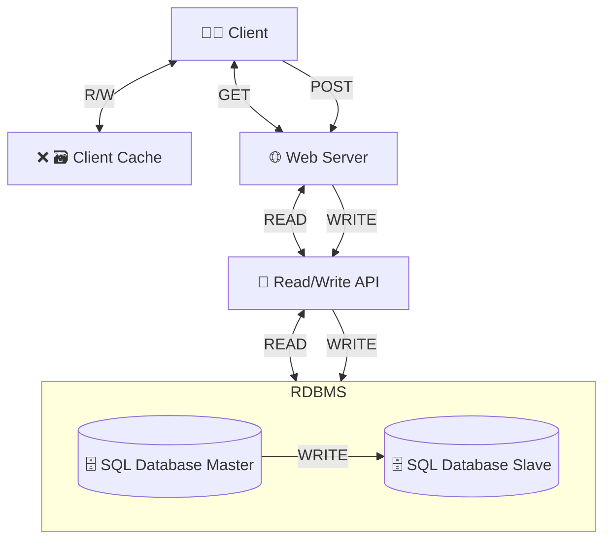

### ✅ Add Read API and Write API

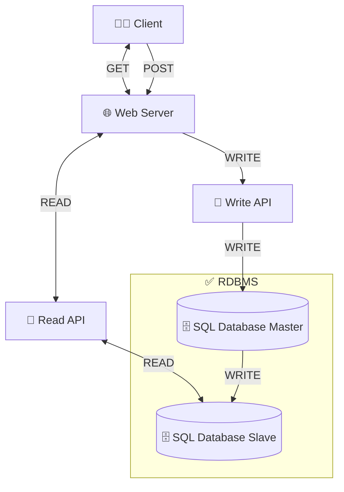

## Stage 3: Improve Read Request Performance

### ❌ Add SQL Master for Read API

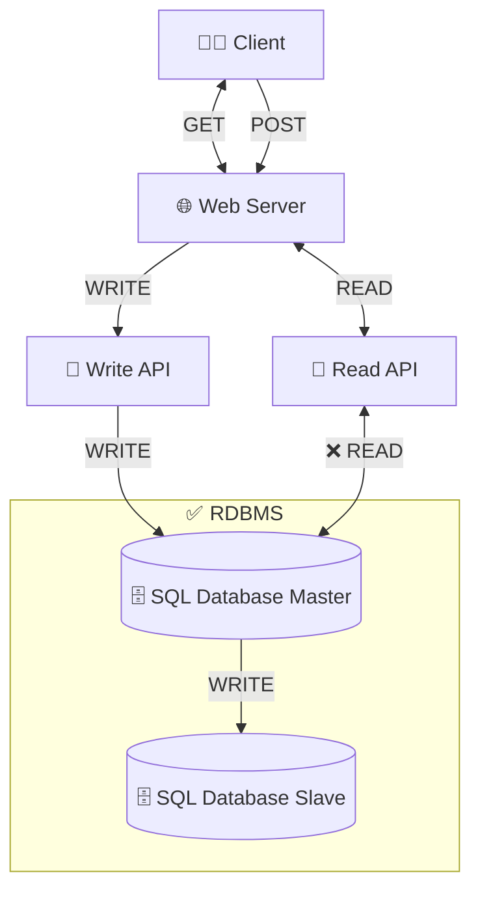

### ❌ Use file system for Read API

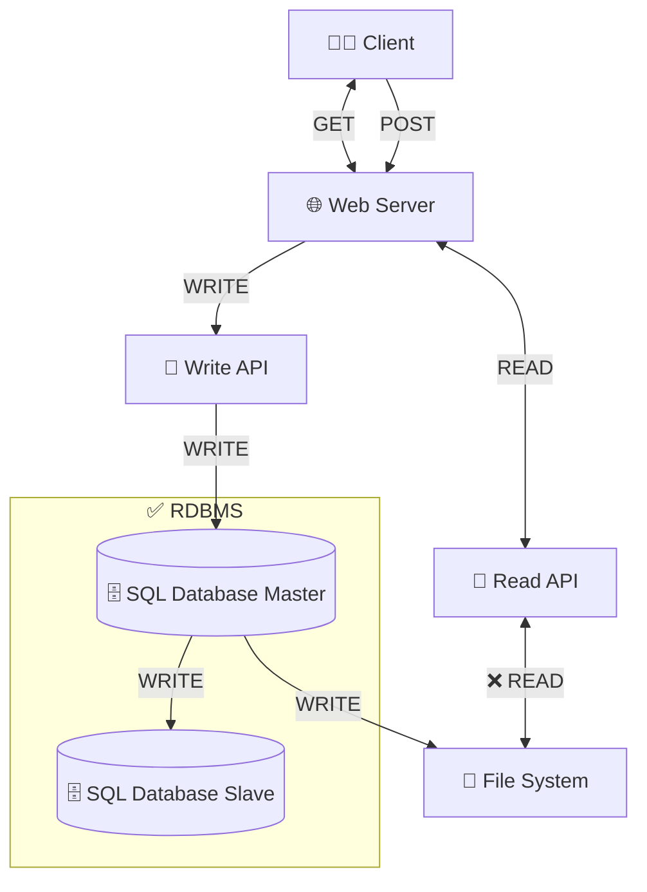

### ✅ Add SQL Replicas for Read API
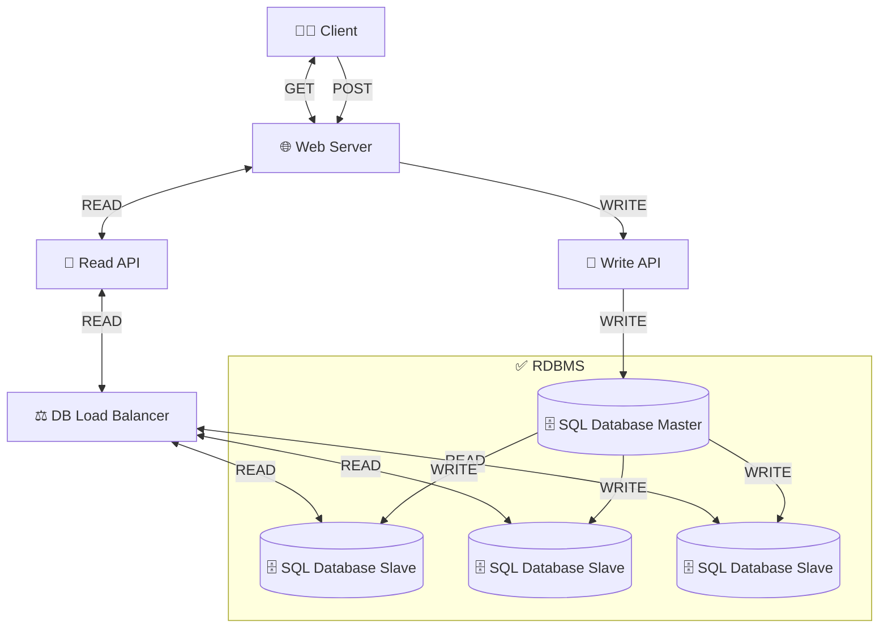

## Stage 3: 

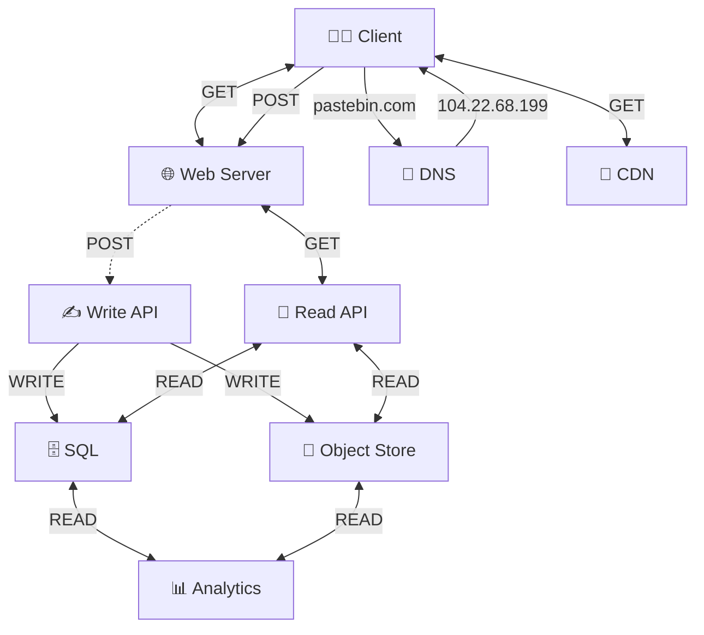

