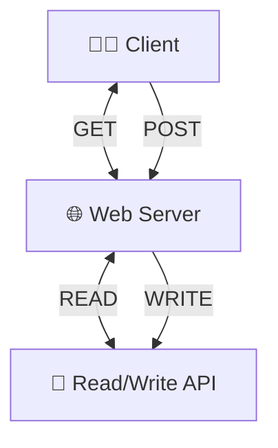
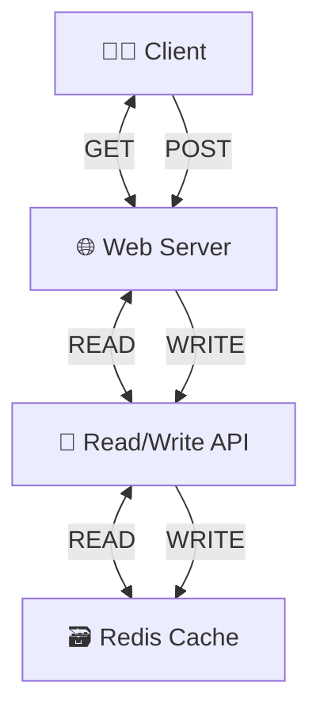
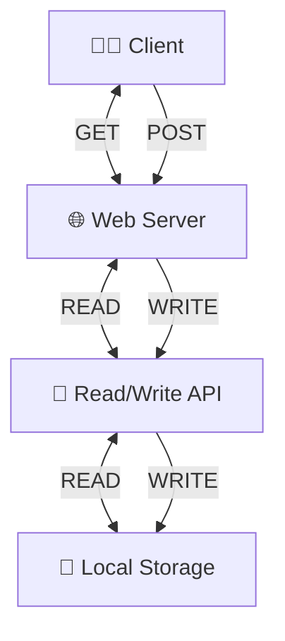
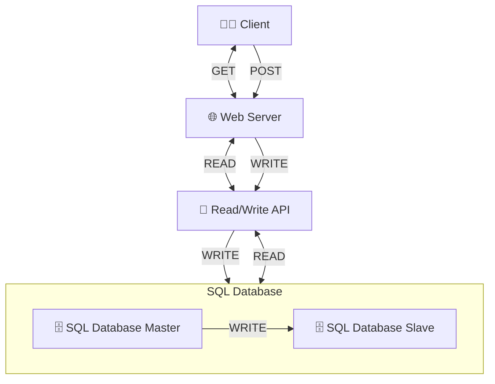
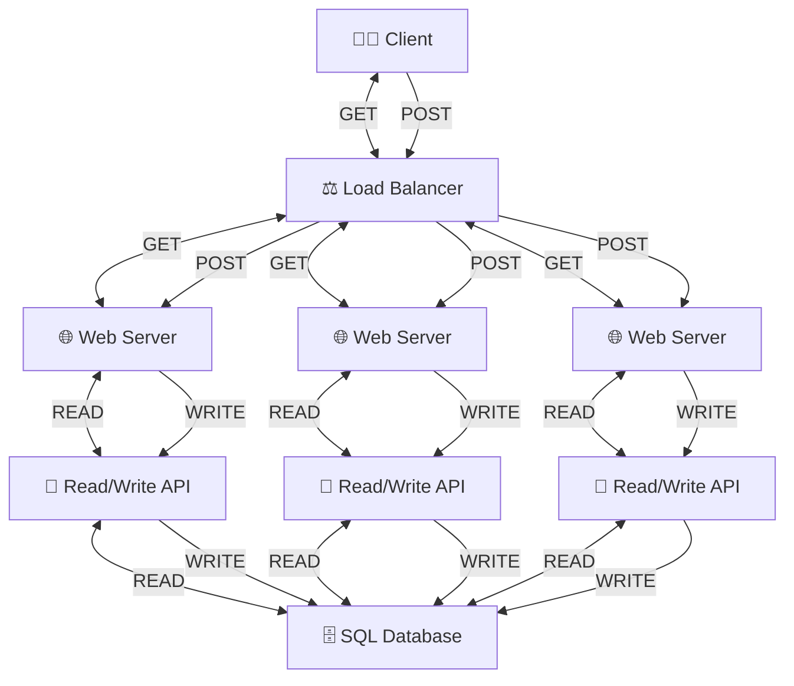
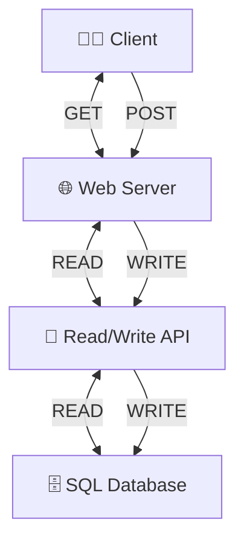
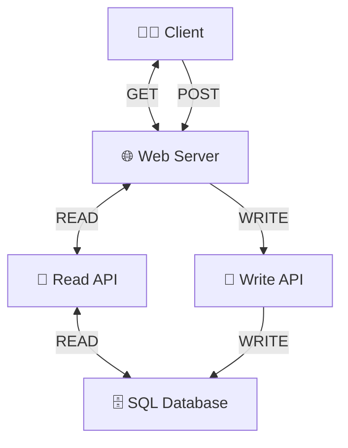
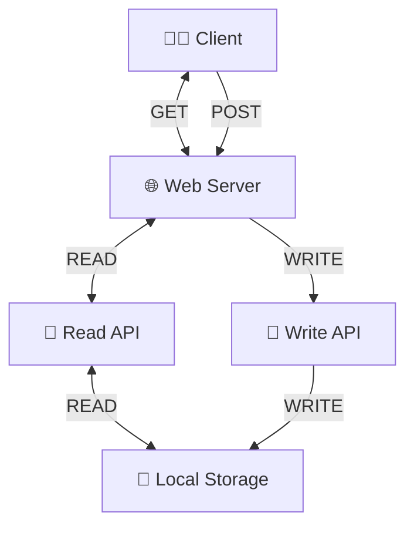
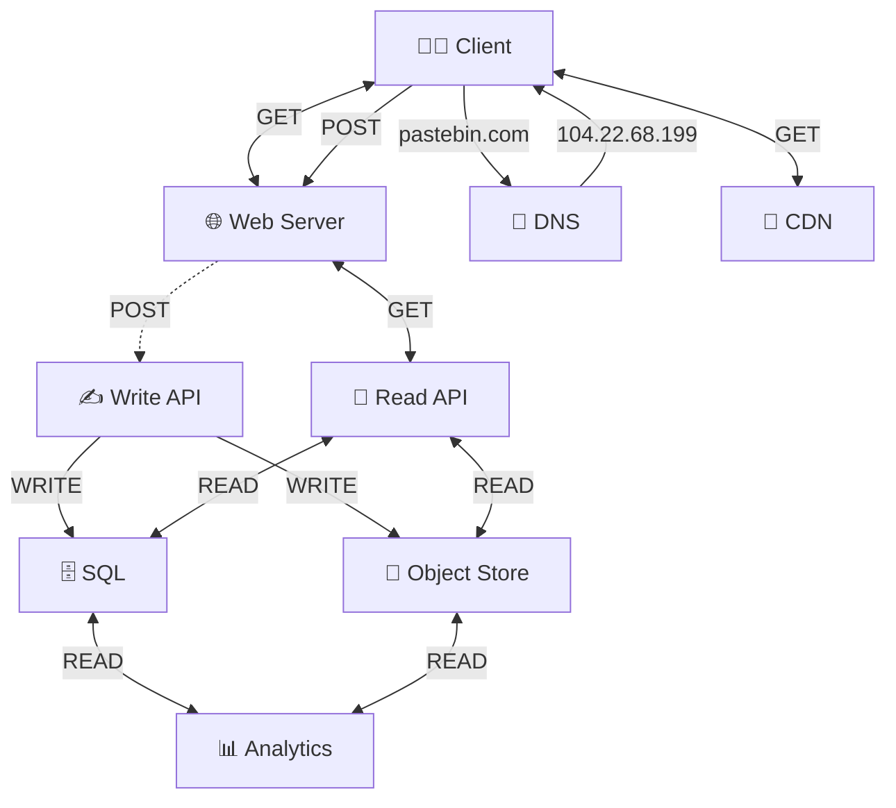

# Pastebin Architecture Diagram

## Stage 0: Initial Diagram and Adding Storage

### ✅ Initial Setup

## Stage 1: Persisting Data

### ❌ Using Redis Cache

### ❌ Use Local Storage

### ✅ Add SQL database

#### Single SQL Database

#### Relational Database Management System (RDBMS)

##### Master-Slave Replication

## Stage 2: Improve Write Request Performance

### ❌ Add more web servers

### ❌ Add client-side caching

### ✅ Add Read API and Write API

## Stage 3: Improve Read Request Performance

## Stage 3: 

