# Pastebin Evolution

## Stage 1: Single Server Handling Everything

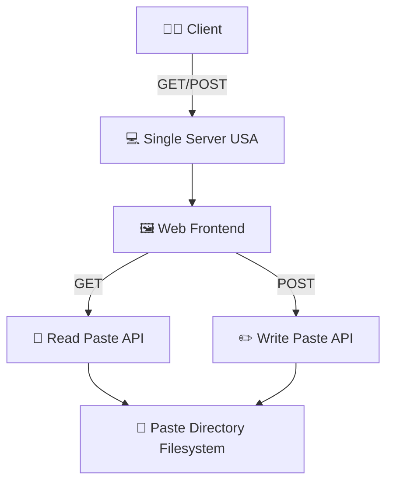
```mermaid
graph TD
    %% Clients
    client[🧑‍💻 Client]

    %% Single Server Handling Everything
    server[💻 Single Server USA]
    frontend[🖼️ Web Frontend]
    readapi[📖 Read Paste API]
    writeapi[✏️ Write Paste API]
    filebasedstore[📁 Paste Directory Filesystem]

    %% Traffic Flow
    client -->|GET/POST| server
    server --> frontend
    frontend -->|GET| readapi
    frontend -->|POST| writeapi
    readapi --> filebasedstore
    writeapi --> filebasedstore
```

## Step 2

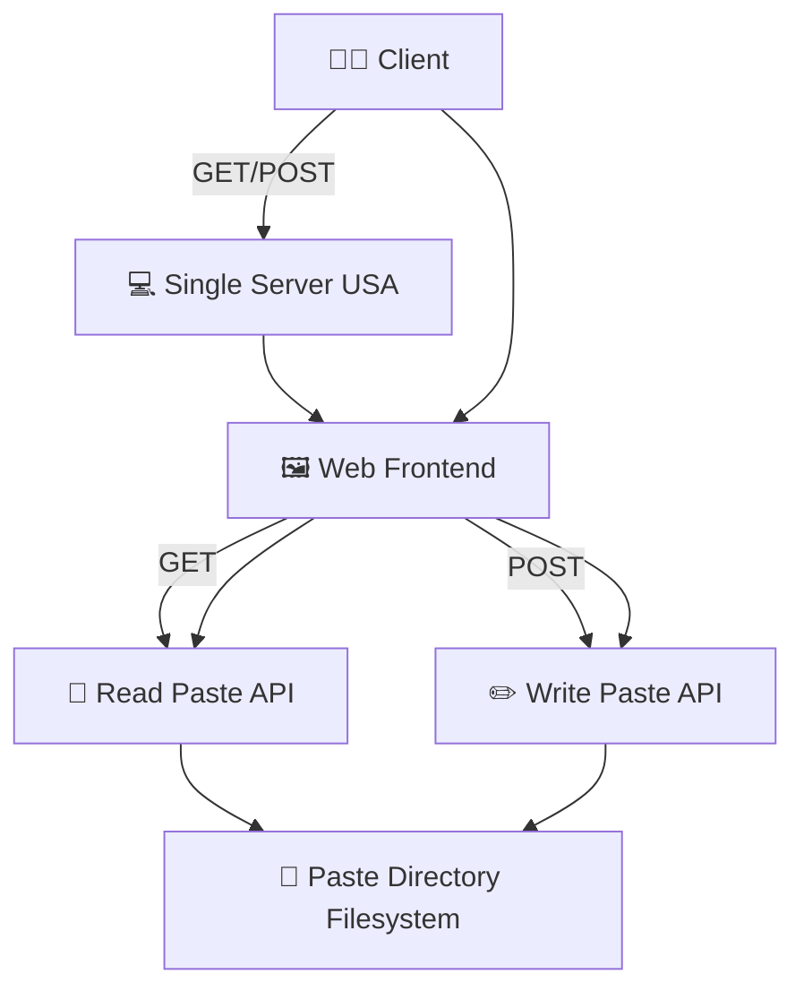
```mermaid
graph TD
  client[🧑‍💻 Client]
  server[💻 Single Server USA]
  frontend[🖼️ Web Frontend]
  readapi[📖 Read Paste API]
  writeapi[✏️ Write Paste API]
  filebasedstore[📁 Paste Directory Filesystem]
  client -->|GET/POST| server
  server --> frontend
  frontend -->|GET| readapi
  frontend -->|POST| writeapi
  readapi --> filebasedstore
  writeapi --> filebasedstore
  client --> frontend
  frontend --> readapi
  frontend --> writeapi
```

## Step 3

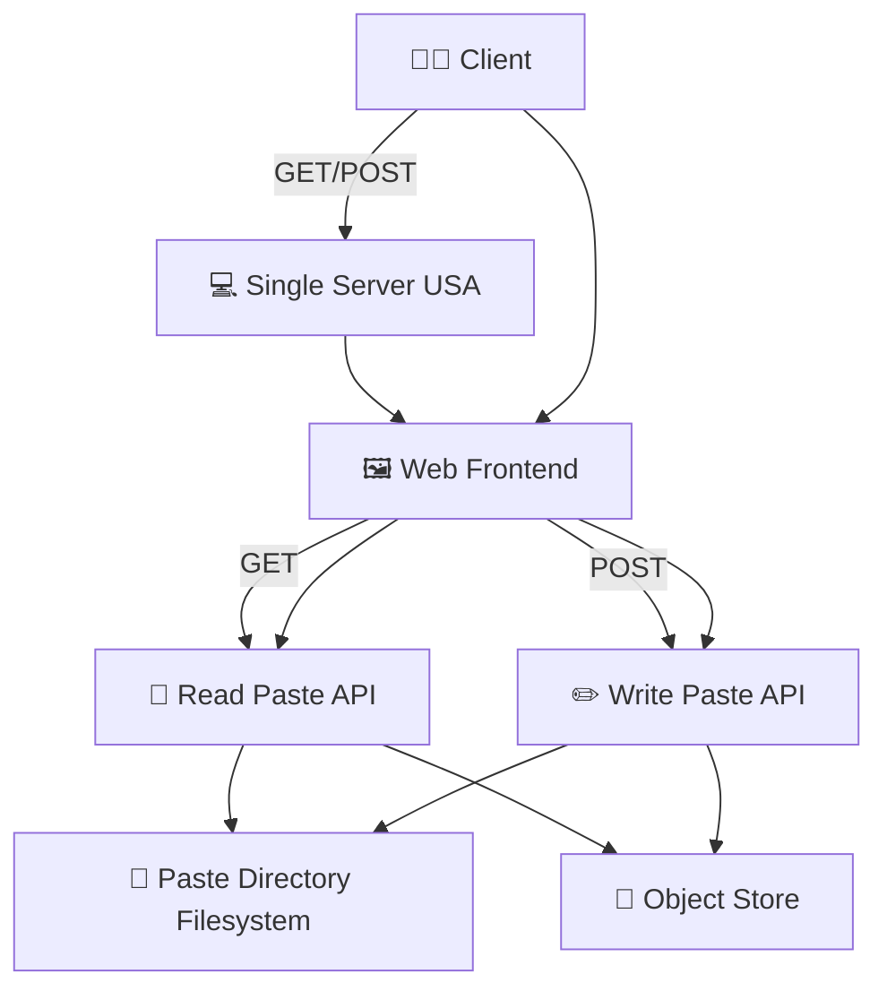
```mermaid
graph TD
  client[🧑‍💻 Client]
  server[💻 Single Server USA]
  frontend[🖼️ Web Frontend]
  readapi[📖 Read Paste API]
  writeapi[✏️ Write Paste API]
  filebasedstore[📁 Paste Directory Filesystem]
  client -->|GET/POST| server
  server --> frontend
  frontend -->|GET| readapi
  frontend -->|POST| writeapi
  readapi --> filebasedstore
  writeapi --> filebasedstore
  client --> frontend
  frontend --> readapi
  frontend --> writeapi
  objectstore[🧺 Object Store]
  readapi --> objectstore
  writeapi --> objectstore
```

## Step 4

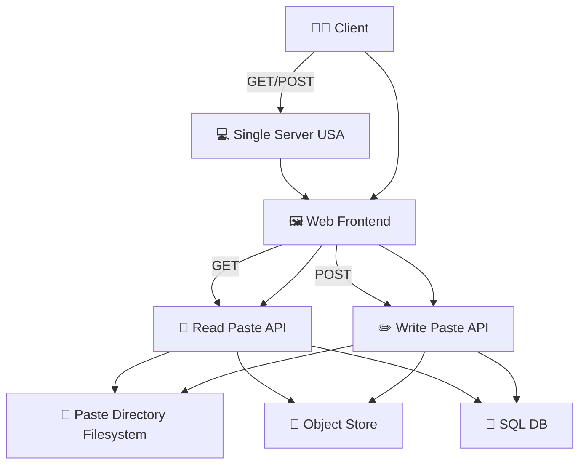
```mermaid
graph TD
  client[🧑‍💻 Client]
  server[💻 Single Server USA]
  frontend[🖼️ Web Frontend]
  readapi[📖 Read Paste API]
  writeapi[✏️ Write Paste API]
  filebasedstore[📁 Paste Directory Filesystem]
  client -->|GET/POST| server
  server --> frontend
  frontend -->|GET| readapi
  frontend -->|POST| writeapi
  readapi --> filebasedstore
  writeapi --> filebasedstore
  client --> frontend
  frontend --> readapi
  frontend --> writeapi
  objectstore[🧺 Object Store]
  readapi --> objectstore
  writeapi --> objectstore
  sql[📒 SQL DB]
  readapi --> sql
  writeapi --> sql
```

## Step 5

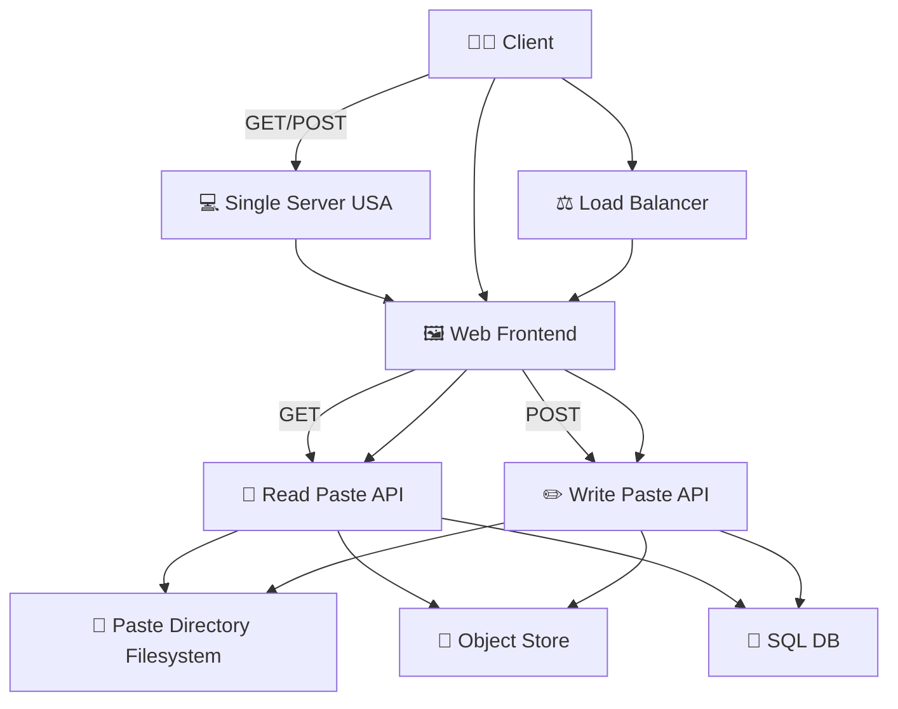
```mermaid
graph TD
  client[🧑‍💻 Client]
  server[💻 Single Server USA]
  frontend[🖼️ Web Frontend]
  readapi[📖 Read Paste API]
  writeapi[✏️ Write Paste API]
  filebasedstore[📁 Paste Directory Filesystem]
  client -->|GET/POST| server
  server --> frontend
  frontend -->|GET| readapi
  frontend -->|POST| writeapi
  readapi --> filebasedstore
  writeapi --> filebasedstore
  client --> frontend
  frontend --> readapi
  frontend --> writeapi
  objectstore[🧺 Object Store]
  readapi --> objectstore
  writeapi --> objectstore
  sql[📒 SQL DB]
  readapi --> sql
  writeapi --> sql
  lb[⚖️ Load Balancer]
  client --> lb
  lb --> frontend
```

## Step 6

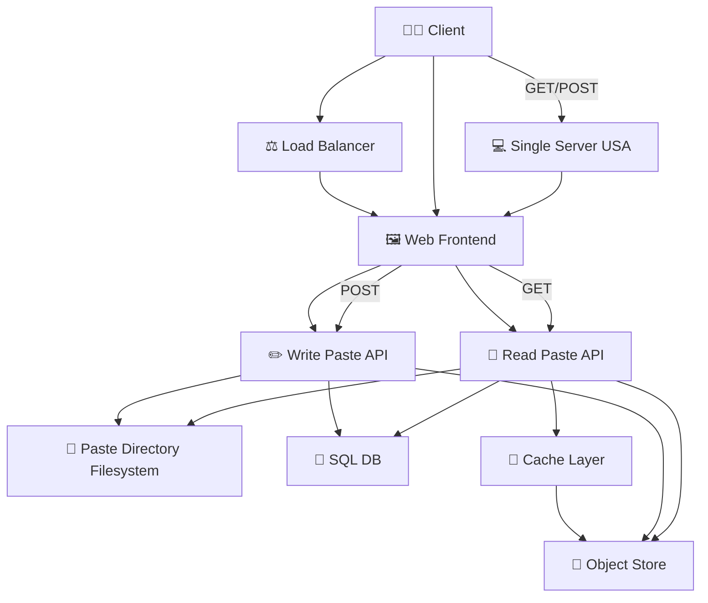
```mermaid
graph TD
  client[🧑‍💻 Client]
  server[💻 Single Server USA]
  frontend[🖼️ Web Frontend]
  readapi[📖 Read Paste API]
  writeapi[✏️ Write Paste API]
  filebasedstore[📁 Paste Directory Filesystem]
  client -->|GET/POST| server
  server --> frontend
  frontend -->|GET| readapi
  frontend -->|POST| writeapi
  readapi --> filebasedstore
  writeapi --> filebasedstore
  client --> frontend
  frontend --> readapi
  frontend --> writeapi
  objectstore[🧺 Object Store]
  readapi --> objectstore
  writeapi --> objectstore
  sql[📒 SQL DB]
  readapi --> sql
  writeapi --> sql
  lb[⚖️ Load Balancer]
  client --> lb
  lb --> frontend
  cache[🧊 Cache Layer]
  readapi --> cache
  cache --> objectstore
```

## Step 7

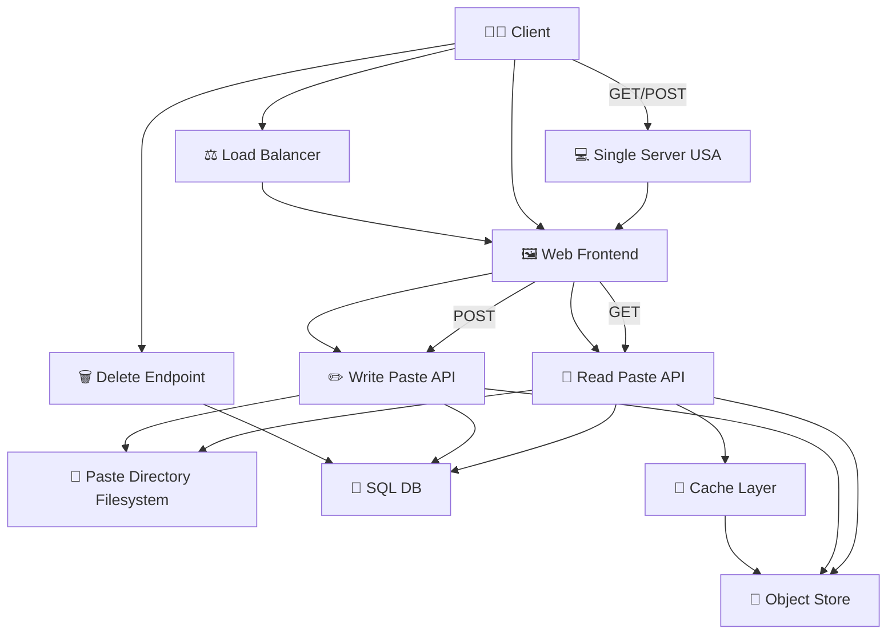
```mermaid
graph TD
  client[🧑‍💻 Client]
  server[💻 Single Server USA]
  frontend[🖼️ Web Frontend]
  readapi[📖 Read Paste API]
  writeapi[✏️ Write Paste API]
  filebasedstore[📁 Paste Directory Filesystem]
  client -->|GET/POST| server
  server --> frontend
  frontend -->|GET| readapi
  frontend -->|POST| writeapi
  readapi --> filebasedstore
  writeapi --> filebasedstore
  client --> frontend
  frontend --> readapi
  frontend --> writeapi
  objectstore[🧺 Object Store]
  readapi --> objectstore
  writeapi --> objectstore
  sql[📒 SQL DB]
  readapi --> sql
  writeapi --> sql
  lb[⚖️ Load Balancer]
  client --> lb
  lb --> frontend
  cache[🧊 Cache Layer]
  readapi --> cache
  cache --> objectstore
  delete[🗑️ Delete Endpoint]
  client --> delete
  delete --> sql
```

## Step 8

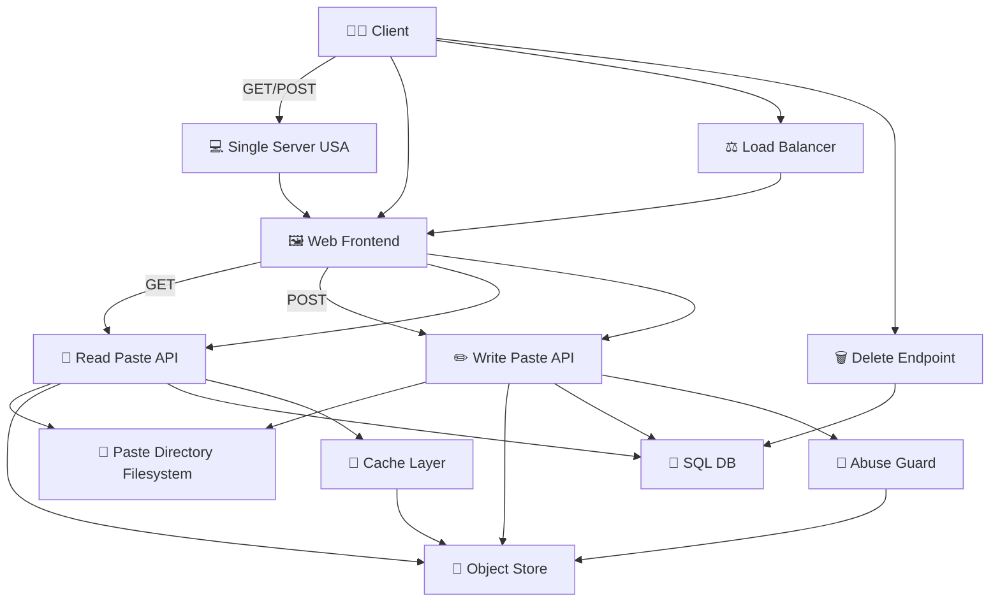
```mermaid
graph TD
  client[🧑‍💻 Client]
  server[💻 Single Server USA]
  frontend[🖼️ Web Frontend]
  readapi[📖 Read Paste API]
  writeapi[✏️ Write Paste API]
  filebasedstore[📁 Paste Directory Filesystem]
  client -->|GET/POST| server
  server --> frontend
  frontend -->|GET| readapi
  frontend -->|POST| writeapi
  readapi --> filebasedstore
  writeapi --> filebasedstore
  client --> frontend
  frontend --> readapi
  frontend --> writeapi
  objectstore[🧺 Object Store]
  readapi --> objectstore
  writeapi --> objectstore
  sql[📒 SQL DB]
  readapi --> sql
  writeapi --> sql
  lb[⚖️ Load Balancer]
  client --> lb
  lb --> frontend
  cache[🧊 Cache Layer]
  readapi --> cache
  cache --> objectstore
  delete[🗑️ Delete Endpoint]
  client --> delete
  delete --> sql
  abuse[🚫 Abuse Guard]
  writeapi --> abuse
  abuse --> objectstore
```

## Step 9

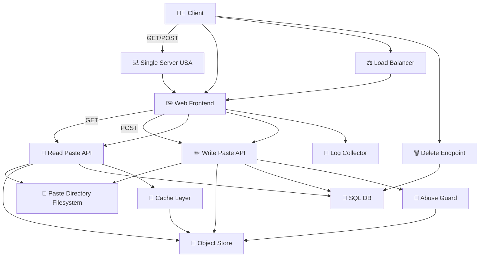
```mermaid
graph TD
  client[🧑‍💻 Client]
  server[💻 Single Server USA]
  frontend[🖼️ Web Frontend]
  readapi[📖 Read Paste API]
  writeapi[✏️ Write Paste API]
  filebasedstore[📁 Paste Directory Filesystem]
  client -->|GET/POST| server
  server --> frontend
  frontend -->|GET| readapi
  frontend -->|POST| writeapi
  readapi --> filebasedstore
  writeapi --> filebasedstore
  client --> frontend
  frontend --> readapi
  frontend --> writeapi
  objectstore[🧺 Object Store]
  readapi --> objectstore
  writeapi --> objectstore
  sql[📒 SQL DB]
  readapi --> sql
  writeapi --> sql
  lb[⚖️ Load Balancer]
  client --> lb
  lb --> frontend
  cache[🧊 Cache Layer]
  readapi --> cache
  cache --> objectstore
  delete[🗑️ Delete Endpoint]
  client --> delete
  delete --> sql
  abuse[🚫 Abuse Guard]
  writeapi --> abuse
  abuse --> objectstore
  logcollector[📜 Log Collector]
  frontend --> logcollector
```

## Step 10

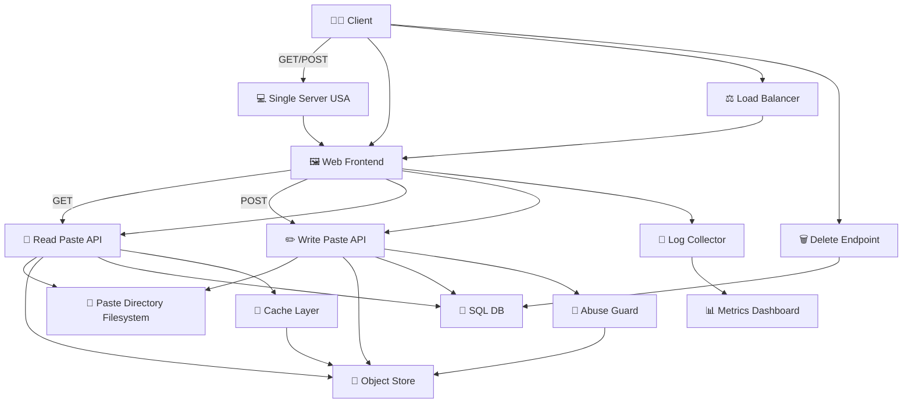
```mermaid
graph TD
  client[🧑‍💻 Client]
  server[💻 Single Server USA]
  frontend[🖼️ Web Frontend]
  readapi[📖 Read Paste API]
  writeapi[✏️ Write Paste API]
  filebasedstore[📁 Paste Directory Filesystem]
  client -->|GET/POST| server
  server --> frontend
  frontend -->|GET| readapi
  frontend -->|POST| writeapi
  readapi --> filebasedstore
  writeapi --> filebasedstore
  client --> frontend
  frontend --> readapi
  frontend --> writeapi
  objectstore[🧺 Object Store]
  readapi --> objectstore
  writeapi --> objectstore
  sql[📒 SQL DB]
  readapi --> sql
  writeapi --> sql
  lb[⚖️ Load Balancer]
  client --> lb
  lb --> frontend
  cache[🧊 Cache Layer]
  readapi --> cache
  cache --> objectstore
  delete[🗑️ Delete Endpoint]
  client --> delete
  delete --> sql
  abuse[🚫 Abuse Guard]
  writeapi --> abuse
  abuse --> objectstore
  logcollector[📜 Log Collector]
  frontend --> logcollector
  metrics[📊 Metrics Dashboard]
  logcollector --> metrics
```

## Step 11

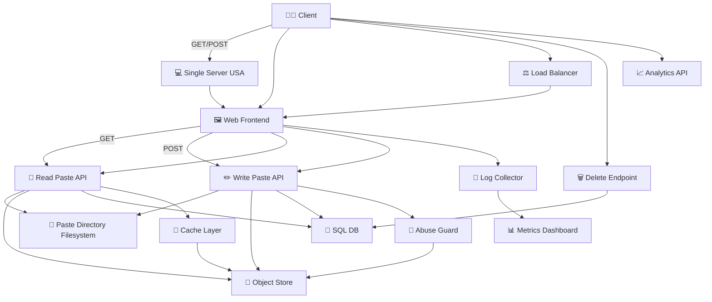
```mermaid
graph TD
  client[🧑‍💻 Client]
  server[💻 Single Server USA]
  frontend[🖼️ Web Frontend]
  readapi[📖 Read Paste API]
  writeapi[✏️ Write Paste API]
  filebasedstore[📁 Paste Directory Filesystem]
  client -->|GET/POST| server
  server --> frontend
  frontend -->|GET| readapi
  frontend -->|POST| writeapi
  readapi --> filebasedstore
  writeapi --> filebasedstore
  client --> frontend
  frontend --> readapi
  frontend --> writeapi
  objectstore[🧺 Object Store]
  readapi --> objectstore
  writeapi --> objectstore
  sql[📒 SQL DB]
  readapi --> sql
  writeapi --> sql
  lb[⚖️ Load Balancer]
  client --> lb
  lb --> frontend
  cache[🧊 Cache Layer]
  readapi --> cache
  cache --> objectstore
  delete[🗑️ Delete Endpoint]
  client --> delete
  delete --> sql
  abuse[🚫 Abuse Guard]
  writeapi --> abuse
  abuse --> objectstore
  logcollector[📜 Log Collector]
  frontend --> logcollector
  metrics[📊 Metrics Dashboard]
  logcollector --> metrics
  analyticsapi[📈 Analytics API]
  client --> analyticsapi
```

## Step 12

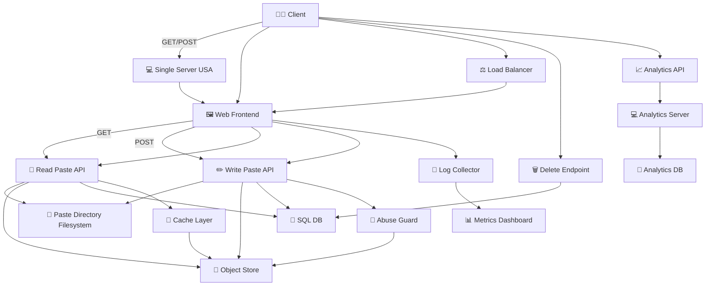
```mermaid
graph TD
  client[🧑‍💻 Client]
  server[💻 Single Server USA]
  frontend[🖼️ Web Frontend]
  readapi[📖 Read Paste API]
  writeapi[✏️ Write Paste API]
  filebasedstore[📁 Paste Directory Filesystem]
  client -->|GET/POST| server
  server --> frontend
  frontend -->|GET| readapi
  frontend -->|POST| writeapi
  readapi --> filebasedstore
  writeapi --> filebasedstore
  client --> frontend
  frontend --> readapi
  frontend --> writeapi
  objectstore[🧺 Object Store]
  readapi --> objectstore
  writeapi --> objectstore
  sql[📒 SQL DB]
  readapi --> sql
  writeapi --> sql
  lb[⚖️ Load Balancer]
  client --> lb
  lb --> frontend
  cache[🧊 Cache Layer]
  readapi --> cache
  cache --> objectstore
  delete[🗑️ Delete Endpoint]
  client --> delete
  delete --> sql
  abuse[🚫 Abuse Guard]
  writeapi --> abuse
  abuse --> objectstore
  logcollector[📜 Log Collector]
  frontend --> logcollector
  metrics[📊 Metrics Dashboard]
  logcollector --> metrics
  analyticsapi[📈 Analytics API]
  client --> analyticsapi
  analyticsbackend[💻 Analytics Server]
  analyticsdb[📒 Analytics DB]
  analyticsapi --> analyticsbackend
  analyticsbackend --> analyticsdb
```

## Step 13

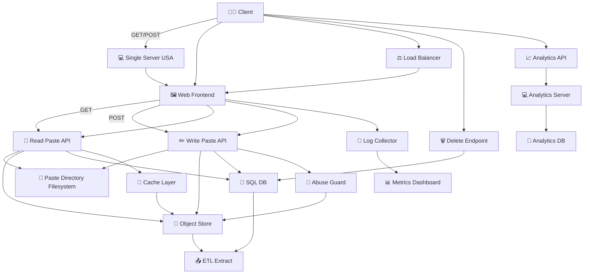
```mermaid
graph TD
  client[🧑‍💻 Client]
  server[💻 Single Server USA]
  frontend[🖼️ Web Frontend]
  readapi[📖 Read Paste API]
  writeapi[✏️ Write Paste API]
  filebasedstore[📁 Paste Directory Filesystem]
  client -->|GET/POST| server
  server --> frontend
  frontend -->|GET| readapi
  frontend -->|POST| writeapi
  readapi --> filebasedstore
  writeapi --> filebasedstore
  client --> frontend
  frontend --> readapi
  frontend --> writeapi
  objectstore[🧺 Object Store]
  readapi --> objectstore
  writeapi --> objectstore
  sql[📒 SQL DB]
  readapi --> sql
  writeapi --> sql
  lb[⚖️ Load Balancer]
  client --> lb
  lb --> frontend
  cache[🧊 Cache Layer]
  readapi --> cache
  cache --> objectstore
  delete[🗑️ Delete Endpoint]
  client --> delete
  delete --> sql
  abuse[🚫 Abuse Guard]
  writeapi --> abuse
  abuse --> objectstore
  logcollector[📜 Log Collector]
  frontend --> logcollector
  metrics[📊 Metrics Dashboard]
  logcollector --> metrics
  analyticsapi[📈 Analytics API]
  client --> analyticsapi
  analyticsbackend[💻 Analytics Server]
  analyticsdb[📒 Analytics DB]
  analyticsapi --> analyticsbackend
  analyticsbackend --> analyticsdb
  extract[📤 ETL Extract]
  sql --> extract
  objectstore --> extract
```

## Step 14

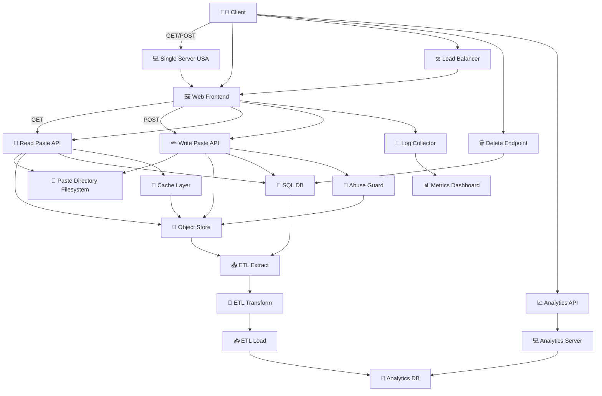
```mermaid
graph TD
  client[🧑‍💻 Client]
  server[💻 Single Server USA]
  frontend[🖼️ Web Frontend]
  readapi[📖 Read Paste API]
  writeapi[✏️ Write Paste API]
  filebasedstore[📁 Paste Directory Filesystem]
  client -->|GET/POST| server
  server --> frontend
  frontend -->|GET| readapi
  frontend -->|POST| writeapi
  readapi --> filebasedstore
  writeapi --> filebasedstore
  client --> frontend
  frontend --> readapi
  frontend --> writeapi
  objectstore[🧺 Object Store]
  readapi --> objectstore
  writeapi --> objectstore
  sql[📒 SQL DB]
  readapi --> sql
  writeapi --> sql
  lb[⚖️ Load Balancer]
  client --> lb
  lb --> frontend
  cache[🧊 Cache Layer]
  readapi --> cache
  cache --> objectstore
  delete[🗑️ Delete Endpoint]
  client --> delete
  delete --> sql
  abuse[🚫 Abuse Guard]
  writeapi --> abuse
  abuse --> objectstore
  logcollector[📜 Log Collector]
  frontend --> logcollector
  metrics[📊 Metrics Dashboard]
  logcollector --> metrics
  analyticsapi[📈 Analytics API]
  client --> analyticsapi
  analyticsbackend[💻 Analytics Server]
  analyticsdb[📒 Analytics DB]
  analyticsapi --> analyticsbackend
  analyticsbackend --> analyticsdb
  extract[📤 ETL Extract]
  sql --> extract
  objectstore --> extract
  transform[🔄 ETL Transform]
  load[📥 ETL Load]
  extract --> transform --> load
  load --> analyticsdb
```

## Step 15

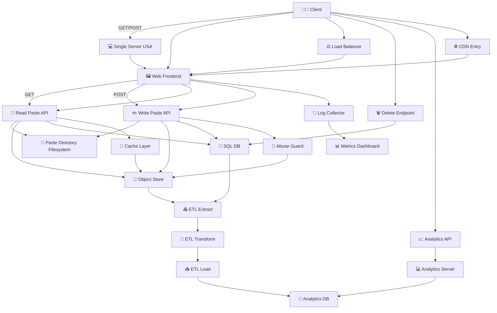
```mermaid
graph TD
  client[🧑‍💻 Client]
  server[💻 Single Server USA]
  frontend[🖼️ Web Frontend]
  readapi[📖 Read Paste API]
  writeapi[✏️ Write Paste API]
  filebasedstore[📁 Paste Directory Filesystem]
  client -->|GET/POST| server
  server --> frontend
  frontend -->|GET| readapi
  frontend -->|POST| writeapi
  readapi --> filebasedstore
  writeapi --> filebasedstore
  client --> frontend
  frontend --> readapi
  frontend --> writeapi
  objectstore[🧺 Object Store]
  readapi --> objectstore
  writeapi --> objectstore
  sql[📒 SQL DB]
  readapi --> sql
  writeapi --> sql
  lb[⚖️ Load Balancer]
  client --> lb
  lb --> frontend
  cache[🧊 Cache Layer]
  readapi --> cache
  cache --> objectstore
  delete[🗑️ Delete Endpoint]
  client --> delete
  delete --> sql
  abuse[🚫 Abuse Guard]
  writeapi --> abuse
  abuse --> objectstore
  logcollector[📜 Log Collector]
  frontend --> logcollector
  metrics[📊 Metrics Dashboard]
  logcollector --> metrics
  analyticsapi[📈 Analytics API]
  client --> analyticsapi
  analyticsbackend[💻 Analytics Server]
  analyticsdb[📒 Analytics DB]
  analyticsapi --> analyticsbackend
  analyticsbackend --> analyticsdb
  extract[📤 ETL Extract]
  sql --> extract
  objectstore --> extract
  transform[🔄 ETL Transform]
  load[📥 ETL Load]
  extract --> transform --> load
  load --> analyticsdb
  cdnentry[🌐 CDN Entry]
  client --> cdnentry
  cdnentry --> frontend
```

## Step 16

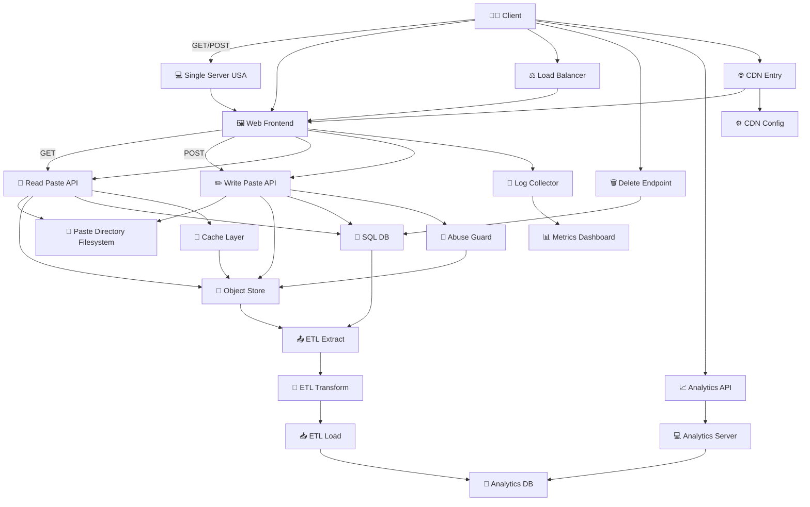
```mermaid
graph TD
  client[🧑‍💻 Client]
  server[💻 Single Server USA]
  frontend[🖼️ Web Frontend]
  readapi[📖 Read Paste API]
  writeapi[✏️ Write Paste API]
  filebasedstore[📁 Paste Directory Filesystem]
  client -->|GET/POST| server
  server --> frontend
  frontend -->|GET| readapi
  frontend -->|POST| writeapi
  readapi --> filebasedstore
  writeapi --> filebasedstore
  client --> frontend
  frontend --> readapi
  frontend --> writeapi
  objectstore[🧺 Object Store]
  readapi --> objectstore
  writeapi --> objectstore
  sql[📒 SQL DB]
  readapi --> sql
  writeapi --> sql
  lb[⚖️ Load Balancer]
  client --> lb
  lb --> frontend
  cache[🧊 Cache Layer]
  readapi --> cache
  cache --> objectstore
  delete[🗑️ Delete Endpoint]
  client --> delete
  delete --> sql
  abuse[🚫 Abuse Guard]
  writeapi --> abuse
  abuse --> objectstore
  logcollector[📜 Log Collector]
  frontend --> logcollector
  metrics[📊 Metrics Dashboard]
  logcollector --> metrics
  analyticsapi[📈 Analytics API]
  client --> analyticsapi
  analyticsbackend[💻 Analytics Server]
  analyticsdb[📒 Analytics DB]
  analyticsapi --> analyticsbackend
  analyticsbackend --> analyticsdb
  extract[📤 ETL Extract]
  sql --> extract
  objectstore --> extract
  transform[🔄 ETL Transform]
  load[📥 ETL Load]
  extract --> transform --> load
  load --> analyticsdb
  cdnentry[🌐 CDN Entry]
  client --> cdnentry
  cdnentry --> frontend
  cdnconfig[⚙️ CDN Config]
  cdnentry --> cdnconfig
```

## Step 17

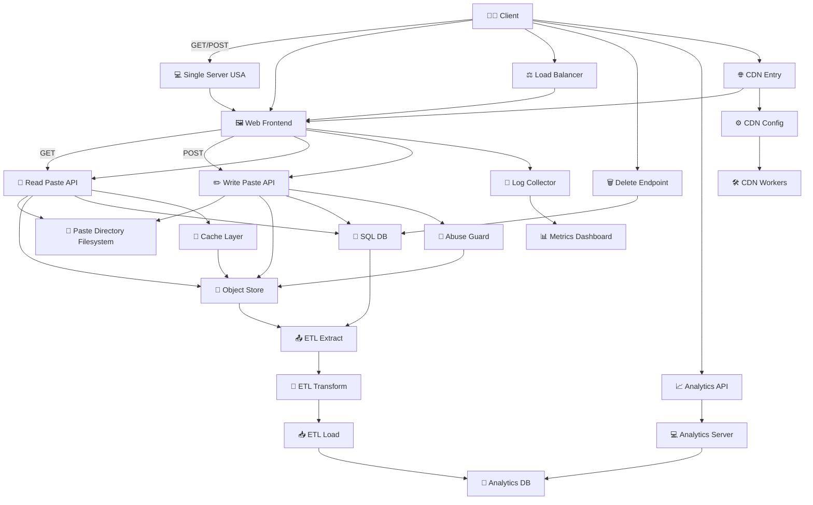
```mermaid
graph TD
  client[🧑‍💻 Client]
  server[💻 Single Server USA]
  frontend[🖼️ Web Frontend]
  readapi[📖 Read Paste API]
  writeapi[✏️ Write Paste API]
  filebasedstore[📁 Paste Directory Filesystem]
  client -->|GET/POST| server
  server --> frontend
  frontend -->|GET| readapi
  frontend -->|POST| writeapi
  readapi --> filebasedstore
  writeapi --> filebasedstore
  client --> frontend
  frontend --> readapi
  frontend --> writeapi
  objectstore[🧺 Object Store]
  readapi --> objectstore
  writeapi --> objectstore
  sql[📒 SQL DB]
  readapi --> sql
  writeapi --> sql
  lb[⚖️ Load Balancer]
  client --> lb
  lb --> frontend
  cache[🧊 Cache Layer]
  readapi --> cache
  cache --> objectstore
  delete[🗑️ Delete Endpoint]
  client --> delete
  delete --> sql
  abuse[🚫 Abuse Guard]
  writeapi --> abuse
  abuse --> objectstore
  logcollector[📜 Log Collector]
  frontend --> logcollector
  metrics[📊 Metrics Dashboard]
  logcollector --> metrics
  analyticsapi[📈 Analytics API]
  client --> analyticsapi
  analyticsbackend[💻 Analytics Server]
  analyticsdb[📒 Analytics DB]
  analyticsapi --> analyticsbackend
  analyticsbackend --> analyticsdb
  extract[📤 ETL Extract]
  sql --> extract
  objectstore --> extract
  transform[🔄 ETL Transform]
  load[📥 ETL Load]
  extract --> transform --> load
  load --> analyticsdb
  cdnentry[🌐 CDN Entry]
  client --> cdnentry
  cdnentry --> frontend
  cdnconfig[⚙️ CDN Config]
  cdnentry --> cdnconfig
  cdnworkers[🛠️ CDN Workers]
  cdnconfig --> cdnworkers
```

## Step 18

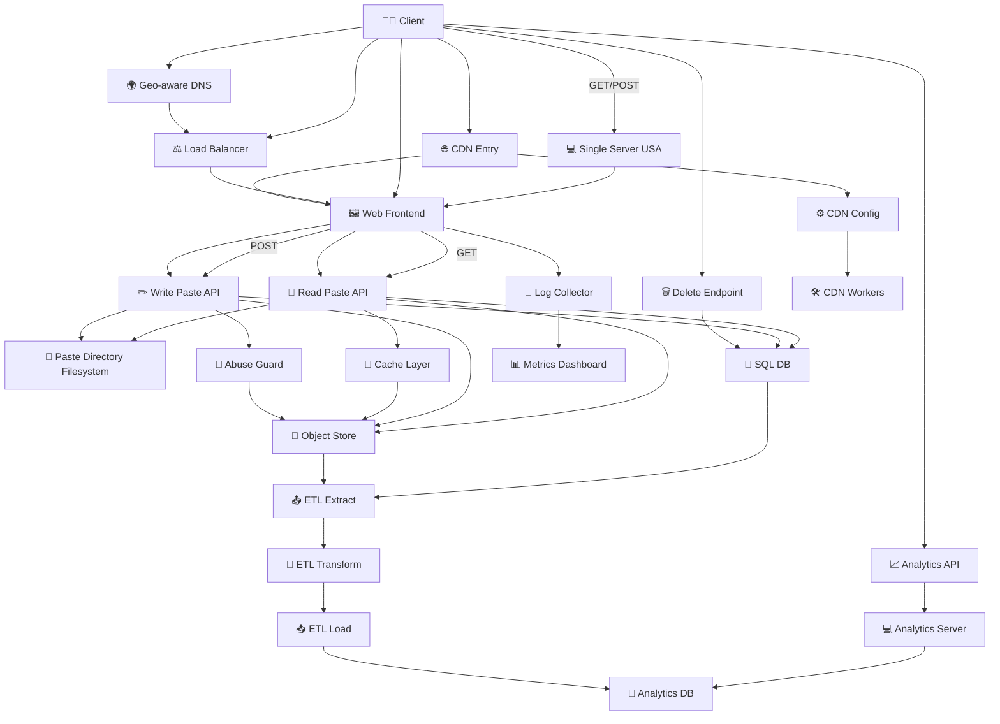
```mermaid
graph TD
  client[🧑‍💻 Client]
  server[💻 Single Server USA]
  frontend[🖼️ Web Frontend]
  readapi[📖 Read Paste API]
  writeapi[✏️ Write Paste API]
  filebasedstore[📁 Paste Directory Filesystem]
  client -->|GET/POST| server
  server --> frontend
  frontend -->|GET| readapi
  frontend -->|POST| writeapi
  readapi --> filebasedstore
  writeapi --> filebasedstore
  client --> frontend
  frontend --> readapi
  frontend --> writeapi
  objectstore[🧺 Object Store]
  readapi --> objectstore
  writeapi --> objectstore
  sql[📒 SQL DB]
  readapi --> sql
  writeapi --> sql
  lb[⚖️ Load Balancer]
  client --> lb
  lb --> frontend
  cache[🧊 Cache Layer]
  readapi --> cache
  cache --> objectstore
  delete[🗑️ Delete Endpoint]
  client --> delete
  delete --> sql
  abuse[🚫 Abuse Guard]
  writeapi --> abuse
  abuse --> objectstore
  logcollector[📜 Log Collector]
  frontend --> logcollector
  metrics[📊 Metrics Dashboard]
  logcollector --> metrics
  analyticsapi[📈 Analytics API]
  client --> analyticsapi
  analyticsbackend[💻 Analytics Server]
  analyticsdb[📒 Analytics DB]
  analyticsapi --> analyticsbackend
  analyticsbackend --> analyticsdb
  extract[📤 ETL Extract]
  sql --> extract
  objectstore --> extract
  transform[🔄 ETL Transform]
  load[📥 ETL Load]
  extract --> transform --> load
  load --> analyticsdb
  cdnentry[🌐 CDN Entry]
  client --> cdnentry
  cdnentry --> frontend
  cdnconfig[⚙️ CDN Config]
  cdnentry --> cdnconfig
  cdnworkers[🛠️ CDN Workers]
  cdnconfig --> cdnworkers
  geodns[🌍 Geo-aware DNS]
  client --> geodns
  geodns --> lb
```

## Step 19

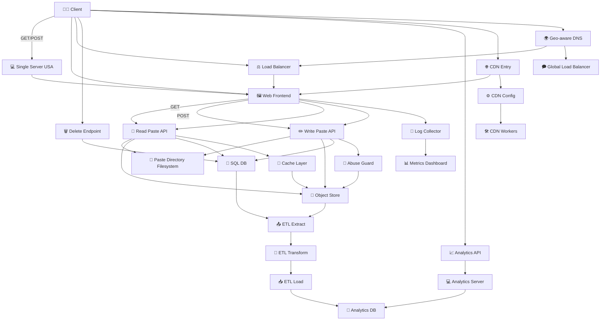
```mermaid
graph TD
  client[🧑‍💻 Client]
  server[💻 Single Server USA]
  frontend[🖼️ Web Frontend]
  readapi[📖 Read Paste API]
  writeapi[✏️ Write Paste API]
  filebasedstore[📁 Paste Directory Filesystem]
  client -->|GET/POST| server
  server --> frontend
  frontend -->|GET| readapi
  frontend -->|POST| writeapi
  readapi --> filebasedstore
  writeapi --> filebasedstore
  client --> frontend
  frontend --> readapi
  frontend --> writeapi
  objectstore[🧺 Object Store]
  readapi --> objectstore
  writeapi --> objectstore
  sql[📒 SQL DB]
  readapi --> sql
  writeapi --> sql
  lb[⚖️ Load Balancer]
  client --> lb
  lb --> frontend
  cache[🧊 Cache Layer]
  readapi --> cache
  cache --> objectstore
  delete[🗑️ Delete Endpoint]
  client --> delete
  delete --> sql
  abuse[🚫 Abuse Guard]
  writeapi --> abuse
  abuse --> objectstore
  logcollector[📜 Log Collector]
  frontend --> logcollector
  metrics[📊 Metrics Dashboard]
  logcollector --> metrics
  analyticsapi[📈 Analytics API]
  client --> analyticsapi
  analyticsbackend[💻 Analytics Server]
  analyticsdb[📒 Analytics DB]
  analyticsapi --> analyticsbackend
  analyticsbackend --> analyticsdb
  extract[📤 ETL Extract]
  sql --> extract
  objectstore --> extract
  transform[🔄 ETL Transform]
  load[📥 ETL Load]
  extract --> transform --> load
  load --> analyticsdb
  cdnentry[🌐 CDN Entry]
  client --> cdnentry
  cdnentry --> frontend
  cdnconfig[⚙️ CDN Config]
  cdnentry --> cdnconfig
  cdnworkers[🛠️ CDN Workers]
  cdnconfig --> cdnworkers
  geodns[🌍 Geo-aware DNS]
  client --> geodns
  geodns --> lb
  globallb[🗭 Global Load Balancer]
  geodns --> globallb
```

## Step 20

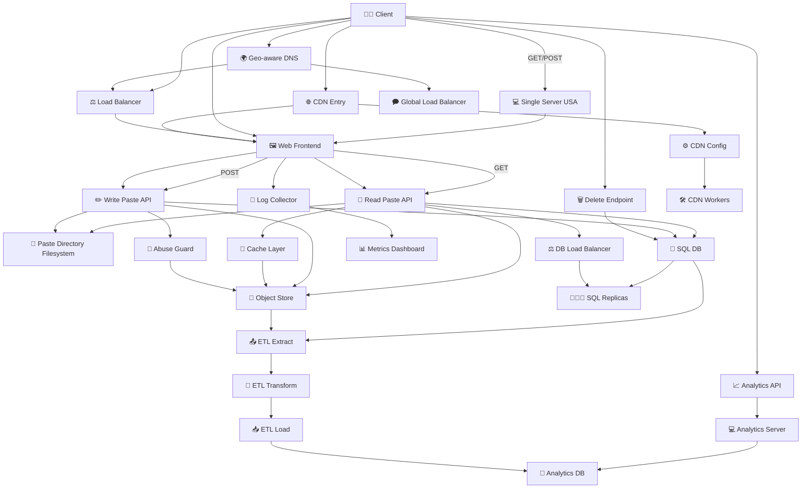
```mermaid
graph TD
  client[🧑‍💻 Client]
  server[💻 Single Server USA]
  frontend[🖼️ Web Frontend]
  readapi[📖 Read Paste API]
  writeapi[✏️ Write Paste API]
  filebasedstore[📁 Paste Directory Filesystem]
  client -->|GET/POST| server
  server --> frontend
  frontend -->|GET| readapi
  frontend -->|POST| writeapi
  readapi --> filebasedstore
  writeapi --> filebasedstore
  client --> frontend
  frontend --> readapi
  frontend --> writeapi
  objectstore[🧺 Object Store]
  readapi --> objectstore
  writeapi --> objectstore
  sql[📒 SQL DB]
  readapi --> sql
  writeapi --> sql
  lb[⚖️ Load Balancer]
  client --> lb
  lb --> frontend
  cache[🧊 Cache Layer]
  readapi --> cache
  cache --> objectstore
  delete[🗑️ Delete Endpoint]
  client --> delete
  delete --> sql
  abuse[🚫 Abuse Guard]
  writeapi --> abuse
  abuse --> objectstore
  logcollector[📜 Log Collector]
  frontend --> logcollector
  metrics[📊 Metrics Dashboard]
  logcollector --> metrics
  analyticsapi[📈 Analytics API]
  client --> analyticsapi
  analyticsbackend[💻 Analytics Server]
  analyticsdb[📒 Analytics DB]
  analyticsapi --> analyticsbackend
  analyticsbackend --> analyticsdb
  extract[📤 ETL Extract]
  sql --> extract
  objectstore --> extract
  transform[🔄 ETL Transform]
  load[📥 ETL Load]
  extract --> transform --> load
  load --> analyticsdb
  cdnentry[🌐 CDN Entry]
  client --> cdnentry
  cdnentry --> frontend
  cdnconfig[⚙️ CDN Config]
  cdnentry --> cdnconfig
  cdnworkers[🛠️ CDN Workers]
  cdnconfig --> cdnworkers
  geodns[🌍 Geo-aware DNS]
  client --> geodns
  geodns --> lb
  globallb[🗭 Global Load Balancer]
  geodns --> globallb
  sqlreplicas[📒📒📒 SQL Replicas]
  dbloadbalancer[⚖️ DB Load Balancer]
  sql --> sqlreplicas
  readapi --> dbloadbalancer --> sqlreplicas
```

## Step 21

```mermaid
graph TD
  client[🧑‍💻 Client]
  server[💻 Single Server USA]
  frontend[🖼️ Web Frontend]
  readapi[📖 Read Paste API]
  writeapi[✏️ Write Paste API]
  filebasedstore[📁 Paste Directory Filesystem]
  client -->|GET/POST| server
  server --> frontend
  frontend -->|GET| readapi
  frontend -->|POST| writeapi
  readapi --> filebasedstore
  writeapi --> filebasedstore
  client --> frontend
  frontend --> readapi
  frontend --> writeapi
  objectstore[🧺 Object Store]
  readapi --> objectstore
  writeapi --> objectstore
  sql[📒 SQL DB]
  readapi --> sql
  writeapi --> sql
  lb[⚖️ Load Balancer]
  client --> lb
  lb --> frontend
  cache[🧊 Cache Layer]
  readapi --> cache
  cache --> objectstore
  delete[🗑️ Delete Endpoint]
  client --> delete
  delete --> sql
  abuse[🚫 Abuse Guard]
  writeapi --> abuse
  abuse --> objectstore
  logcollector[📜 Log Collector]
  frontend --> logcollector
  metrics[📊 Metrics Dashboard]
  logcollector --> metrics
  analyticsapi[📈 Analytics API]
  client --> analyticsapi
  analyticsbackend[💻 Analytics Server]
  analyticsdb[📒 Analytics DB]
  analyticsapi --> analyticsbackend
  analyticsbackend --> analyticsdb
  extract[📤 ETL Extract]
  sql --> extract
  objectstore --> extract
  transform[🔄 ETL Transform]
  load[📥 ETL Load]
  extract --> transform --> load
  load --> analyticsdb
  cdnentry[🌐 CDN Entry]
  client --> cdnentry
  cdnentry --> frontend
  cdnconfig[⚙️ CDN Config]
  cdnentry --> cdnconfig
  cdnworkers[🛠️ CDN Workers]
  cdnconfig --> cdnworkers
  geodns[🌍 Geo-aware DNS]
  client --> geodns
  geodns --> lb
  globallb[🗭 Global Load Balancer]
  geodns --> globallb
  sqlreplicas[📒📒📒 SQL Replicas]
  dbloadbalancer[⚖️ DB Load Balancer]
  sql --> sqlreplicas
  readapi --> dbloadbalancer --> sqlreplicas
  reverseproxy[🔄 Storage Proxy]
  readapi --> reverseproxy --> objectstore
  writeapi --> reverseproxy
```

## Stage 22: Complete Pastebin Architecture

```mermaid
graph TD
	%% Subgraph: Global Nodes
	subgraph global [🌐 Global Infrastructure]
        subgraph region_client[🧑‍💻 Clients 🇺🇸 🇪🇺 🇮🇱 🇯🇵]
            us_client[🧑‍💻 Client 🇺🇸]
            eu_client[🧑‍💻 Client 🇪🇺]
            il_client[🧑‍💻 Client 🇮🇱]
            jp_client[🧑‍💻 Client 🇯🇵]
        end
        geodns[🌐 Geo-aware DNS]
        globallb[Global Load Balancer]
	end

    %% Regional Application Stack
    subgraph region_region[Regions - USA, EU, etc]
        subgraph region_origin[💻 Origin 🇺🇸 🇪🇺 🇮🇱 🇯🇵]
            waf[🛡️ WAF / Rate Limiter]
            abuseguard[🚫 Abuse Protection]
            region_cache[🧊 App Cache Layer]
            region_frontend[🖼️ Front End]
            region_read_api[📖 Read API]
            region_write_api[✏️ Write API]
            pastedelete[🗑️ Delete Paste Token Validated]
        end
    end

	%% Analytics Microservice
	subgraph analyticsmicroservice[📊 Analytics Microservice]
		analyticsclient[🧑‍💻 Analytics Client]
		analyticsapiendpoint[📈 Analytics API Endpoint]
		analyticsapiserver[💻 Back End 📊]
		analyticsdb[📒 Analytics DB]

        subgraph etl[🛠️ ETL Pipeline]
            etlextract[📤 Extract: SQL + Object Store]
            etltransform[🔄 Transform: Normalize & Join]
            etlload[📥 Load to Analytics API]
            etljob[⏱️ Daily ETL Job Trigger]
        end

	end

    sqlmaster --> etlextract
    objectstore --> etlextract
    etljob --> etlextract --> etltransform --> etlload --> analyticsapiendpoint

	%% SQL + Object Storage
	subgraph sqldb[✅ Storage]
		storagereverseproxy[🔄 Storage Reverse Proxy]
		objectstore[🧺 Object Store 🟣🟣🟣]
		sqlmaster[(📒 SQL DB Master)]
        sqlslaves[(📒📒📒 SQL DB Slaves)]
		dbloadbalancer[⚖️ Replica Load Balancer]
	end

	%% CDN Layer
	subgraph cdn [🌐 CDN]
		cdnentrypoint[🌐 CDN Entry Point]
		cdnloadbalancer[⚖️ CDN Ingest Load Balancer]
		cdnserver[🔄 CDN Ingest Server]
		cdnworkerpool[🛠️🛠️🛠️ CDN Worker Pool]
        cdnconfig[⚙️ CDN TTL & Cache Rules]
	end

	%% Monitoring
	subgraph observability[🧭 Observability]
        logcollector[📜 Log Collector]
        monitorbackend[📊 Metrics / Dashboards]
	end

	%% Traffic Flow
	region_client -->|GET/POST 📄🟣| geodns
	geodns --> globallb
    globallb -->|Static/Dynamic 📄| cdnentrypoint

    cdnentrypoint --> cdnconfig --> cdnloadbalancer --> cdnserver --> cdnworkerpool

    cdnentrypoint -->|Deliver content| region_client

	%% CDN fetches from origin on cache miss
	cdnserver --> region_frontend

	%% Origin App Logic
	region_frontend -->|GET 📄| region_read_api
	region_frontend -->|POST 📄| region_write_api
	region_read_api --> region_cache
	region_cache --> region_read_api

	waf --> region_frontend
	region_write_api --> abuseguard
	abuseguard --> storagereverseproxy

	region_write_api --> pastedelete
	pastedelete --> storagereverseproxy

	region_read_api --> storagereverseproxy
	storagereverseproxy -->|READ/WRITE 🟣| objectstore
	storagereverseproxy -->|WRITE 📄| sqlmaster

	%% DB Replication
	sqlmaster -->|🔁 Replication| sqlslaves

	%% Storage Failover
	storagereverseproxy -->|READ 📄| dbloadbalancer --> sqlslaves

	%% Analytics Flow
	analyticsapiendpoint --> analyticsapiserver
	analyticsapiserver -->|RW 📄| analyticsdb
	analyticsclient <-->|GET 📊| analyticsapiendpoint

	%% Logging
	region_frontend --> logcollector
	logcollector --> monitorbackend
```
