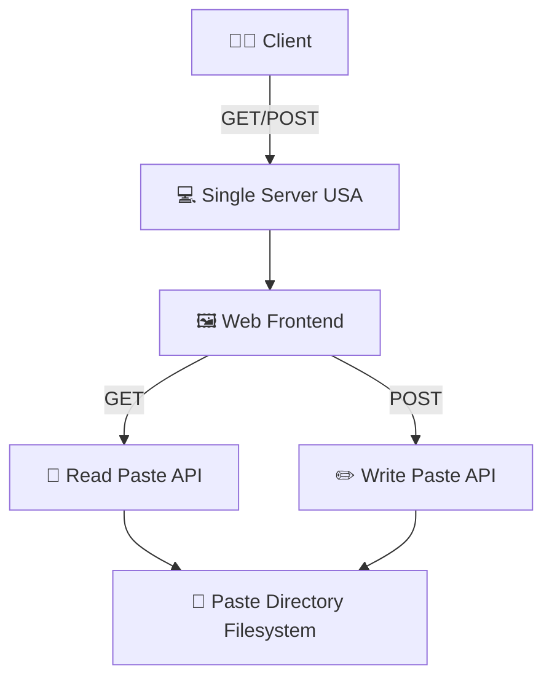

```mermaid
graph TD
    %% Clients
    client[🧑‍💻 Client]

    %% Single Server Handling Everything
    server[💻 Single Server USA]
    frontend[🖼️ Web Frontend]
    readapi[📖 Read Paste API]
    writeapi[✏️ Write Paste API]
    filebasedstore[📁 Paste Directory Filesystem]

    %% Traffic Flow
    client -->|GET/POST| server
    server --> frontend
    frontend -->|GET| readapi
    frontend -->|POST| writeapi
    readapi --> filebasedstore
    writeapi --> filebasedstore
```
